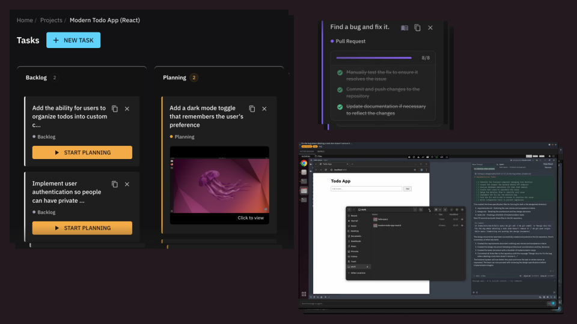
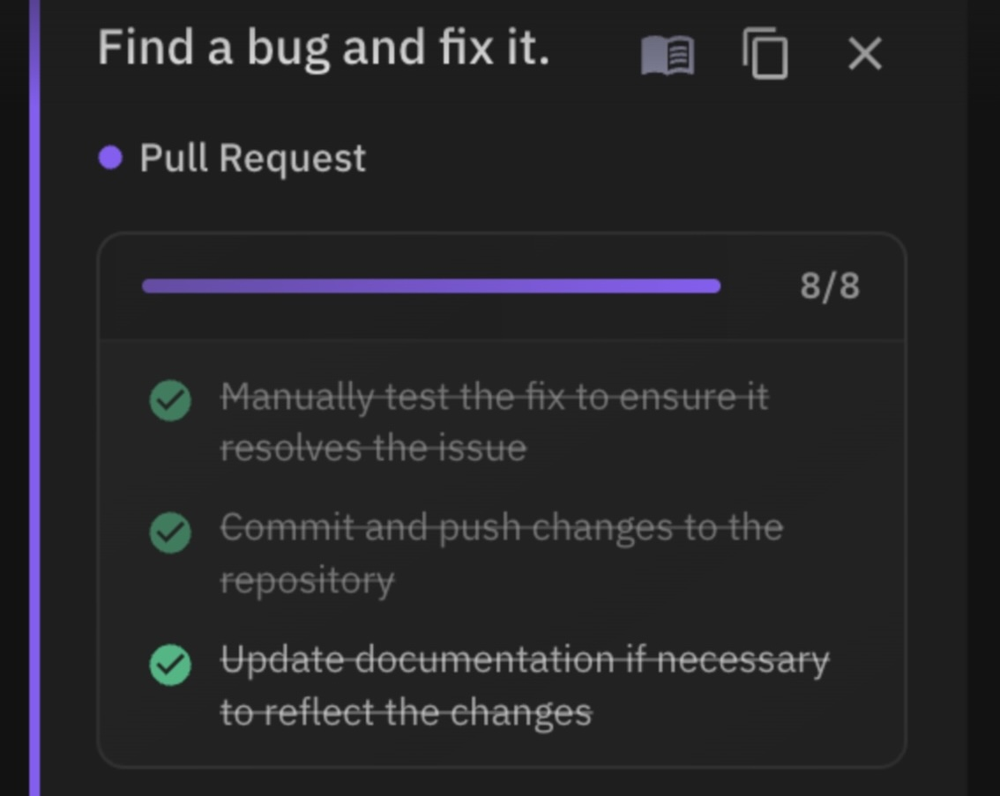

## Install with our quickstart script

```bash
curl -sL -O https://get.helixml.tech/install.sh
chmod +x install.sh
sudo ./install.sh
```

Then attach GPU runners or use any OpenAI-compatible LLM. For Kubernetes, see the [private deployment docs]().

Helix exposes an OpenAI-compatible chat completions API:

```shell
curl https://your-helix-server/v1/chat/completions \
  -H 'Authorization: Bearer <YOUR_API_KEY>' \
  -H 'Content-Type: application/json' \
  -d '{
    "model": "llama3:instruct",
    "messages": [{"role": "user", "content": "Hello!"}]
  }'
```
Get your API key from the Account page in the app.

Try our hosted [Helix Cloud](https://app.tryhelix.ai) today to see what it can do, then come back here to learn how to deploy it yourself.

[Full API reference]()

## What is Helix?

HelixML is an enterprise-grade GenAI platform for building and deploying AI agents. Deploy coding agents, customer support bots, and document processing pipelines in your own data center or VPC while retaining complete data security and control.

The platform supports RAG (Retrieval-Augmented Generation), API calling, vision, and multiple LLM providers including OpenAI, Anthropic, and local open-weight models. Build applications by writing a simple [`helix.yaml`]() configuration file.


## Coding Agents

Helix lets you run fleets of background coding agents, each with its own GPU-accelerated Linux desktop. These aren't terminal wrappers or sandboxed environments—they're real desktops you can stream from anywhere with sub-100ms latency.



Agents follow a spec-first workflow: they write design docs before touching code, giving you a chance to review and approve the architecture. Once you sign off, they implement. This catches design issues early instead of after thousands of lines have been written.


A Kanban board shows what every agent is working on, where they're stuck, and what they need from you. When an agent hits a wall, jump into their desktop and pair program. They run your actual development tools—Zed, VS Code, browser DevTools—so debugging feels familiar.



## Skills and Tools

Agents interact with external systems through skills and tools. Define REST APIs with OpenAPI schemas and agents can call them. Connect MCP (Model Context Protocol) servers for standardized tool interfaces. Write GPTScript for custom logic. OAuth token management handles authentication to third-party services automatically.

The agent hierarchy works like this: Sessions manage lifecycle and state. Agents coordinate skills and handle LLM interactions. Skills group related tools for specific capabilities. Tools are individual actions—API calls, functions, scripts.

## Knowledge Management

Helix ingests documents (PDFs, Word files, text) and extracts content from websites automatically. Multiple RAG backends are supported: Typesense for fast keyword search, Haystack for sophisticated pipelines, PGVector for semantic embeddings, and LlamaIndex for advanced retrieval patterns. Vision RAG handles multimodal content like screenshots and diagrams.

Upload corporate documents to build internal knowledge bases. Point at documentation URLs to create instant customer support agents. Combine multiple sources into a single searchable corpus.

## Tracing and Observability

Agents can process tens of thousands of tokens per step across multiple LLM calls, API requests, and tool invocations. Helix traces everything: every agent execution step, every request and response to LLM providers, third-party APIs, and MCP servers. Real-time token usage tracking shows exactly what's being consumed. Cost analysis breaks down pricing by model and operation.

## Enterprise Features

Helix supports multi-tenancy with organizations, teams, and role-based access control. Schedule tasks with cron jobs or trigger workflows via webhooks. The evaluation framework lets you test agent quality systematically. Stripe integration handles payments for SaaS deployments. Notifications go out via Slack, Discord, or email. Authentication supports OAuth and OIDC, integrating with enterprise ActiveDirectory and LDAP.

## GPU Scheduling

The intelligent GPU scheduler packs models efficiently into available memory and dynamically loads and unloads them based on demand. Deploy a single control plane and connect GPUs from anywhere—your enterprise datacenter, a cloud provider, or specialists like RunPod or Lambda Labs—and they all appear in one unified environment.

## Deployment Options

For Docker deployments, use the [quickstart installer]() to get running in minutes. Kubernetes users can deploy with Helm charts documented in the [private deployment guide](). To evaluate before self-hosting, try [Helix Cloud](https://app.helix.ml).
