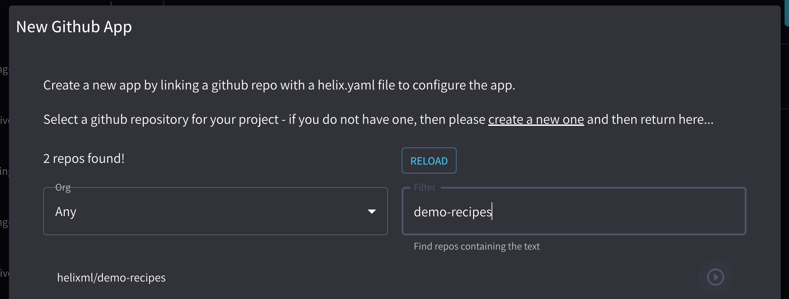

Helix supports [GPTScript](https://gptscript.ai) to allow you to write simple "scripted" natural language powered apps by just writing prompts.

We support a development workflow where you run the Helix GPTScript Dev Server locally, and a production workflow where you deploy updates to GPTScript powered apps via `git push`.


We provide a simple Javascript library (and API) to call into GPTScript you push to a git repo and run it securely in a microVM so you don't need to worry about the user convincing the LLM to run malicious commands – it all runs in a throwaway VM anyway.

## Example Javascript Code

Install **[@helixml/apps-client](https://www.npmjs.com/package/@helixml/apps-client)** from npm:

```bash
npm i @helixml/apps-client
```

Add to your Javascript code:

```js
import AppClient from '@helixml/apps-client'

const appClient = AppClient({
  token: "your app token",
})
```

Where "your app token" comes from the API key for that app on the app configuration page at [https://app.tryhelix.ai/apps](https://app.tryhelix.ai/apps) (you'll need to link a github repository).


Then from inside your app, you can simply call the gptscript by using `appClient.runScript`. Ask the AI nicely for JSON output, then parse it on the Javascript side. Example:

```js
const result = await appClient.runScript({
    file_path: '/gptscripts/waitrose.gpt',
    input: `--user_id '${email}' --number '2' --recipe_theme '${recipeTheme}'`,
})
```

## Example gptscript

GPTScript is pretty easy to write, first you declare which tools you want the script to be able to use, then you specify arguments (as shown being passed in above), then you just write instructions for the LLM (including calling its tools) in natural language. For example, here's a recipe suggestion picker for customized recipe recommendations:

`waitrose.gpt`:
```
tools: recipe.query, purchases.query, sys.read
args: user_id: The user_id we want to know about.
args: recipe_theme: The theme of the recipes.
args: number: The number of recipes to output.

Do the following steps sequentially:
  1. Run tool {recipe.query} to get a list of candidate recipes for the given
     user as a CSV file written to recipes.csv.
  2. Run tool {purchases.query} to get a list of the top 10 products most bought
     by the given user written to purchases.csv.
  3. Read files recipes.csv (the suggested recipes) and purchases.csv (the
     user's previous top purchase history) and output a JSON list of {number},
     {recipe_theme} theme recipes that you think the user would like based on
     their purchase history.

[...]

Output the exact image url from the CSV file, do not invent one. Output format:

[{
  "recipe.name": "name",
  "recipe.summary": "summary",
  "recipe.imageurl": "imageurl"
}]
```

<!-- TODO: write docs for apps/gptscript API -->

## Example helix.yaml

You must tell helix where to search for gptscripts in a simple `helix.yaml`:
```
gptscript:
  files:
    - gptscripts/*.gpt
```

## Tutorial: React Recipe Recommendation App

You can use this sample React app as a starting point for your own AI powered apps.


### Step 1: Fork the example repo

Go to GitHub and fork [github.com/helixml/demo-recipes](https://github.com/helixml/demo-recipes).

### Step 2: Connect the repo to Helix Cloud

Go to [app.tryhelix.ai/apps](https://app.tryhelix.ai/apps) and click New App:


Connect to your GitHub account, then select the fork from the dropdown:



Click the play button. Click Connect Repo.

This will set up a deploy key and webhooks so that Helix can read the contents of the repo (even if it's private) and be notified when you push to the git repo so that Helix can automatically deploy changes to the gptscripts.

### Step 3: Deploy the frontend app somewhere

Now deploy the frontend app to a web server of your choice, for example Netlify, Vercel, or your own internal web application platform.

You can skip this step if you just want to test local development for now.

### Step 4: Local Development

Clone the repo locally, [get an API key from OpenAI](https://github.com/gptscript-ai/gptscript?tab=readme-ov-file#2-get-an-api-key-from-openai) and then run:

Run:
```bash
bash helix-server.sh
```
This will start the helix dev server, which runs gptscript in a container locally on your machine.

The `apps-client` JS library will automatically try to connect to the gptscript dev server if you are running the app locally.

Now start the server:
```bash
yarn install
yarn start
```

The app should pop up in your browser:


Start by putting your name in the box, and see that the "hello world" `gptscripts/welcome.gpt`:
```
description: Returns back the input of the script
args: input: Any string
echo "Welcome ${input}!"
```
Indeed returns "welcome, yourname".

Now, enter either `alice@alice.com` or `bob@bob.com` (since these are the users who are registered in the bundled sqlite database in the demo) and select a type of recipe you'd like to recommend to them based on their purchase history.

If you watch the helix dev server, you'll be able to see gptscript doing its thing.


### Step 5: Deploy to Production

Now you should have the github repo (your fork) hooked up to an external hosting service like Netlify or Vercel (step 3) and also hooked up to Helix Cloud, where Helix can receive the webhooks and immediately deploy updates to the gptscripts.

Try changing something, for example add a word to the suggested summary/justification field in `waitrose.gpt`, then just do:

```
git commit -am "deploy change to wording"
git push
```

Now Helix will receive the webhook from GitHub and instantly future requests for that gptscript will use the updated version.

### Step 6: Customize the app for your own use case

You've seen how you can develop a sophisticated, AI powered app just with Javascript and natural language (and a bit of sqlite).
Start customizing the app for your own use cases. We'd love to see what you build!

## Come talk to us!

Come join us in [Discord](https://discord.gg/VJftd844GE) to give us feedback on this and talk about your use case!
We'd love to see what you build.

## GPTScript tips

One tip when writing gptscript, is to make the LLM spend as much time outputting things that are natural language, and not to spend time transferring data from one place to another. That's why in this example, we tell sqlite to write its result as a csv file using the `.output` command:
```
---
name: purchases.query
tools: sys.exec
description: Query for the top 10 products most bought products by user_id, writing result to purchases.csv.
--command
sqlite3 recipes.sqlite <<EOF
.headers on
.mode csv
.output purchases.csv
SELECT product, quantity
FROM Purchases
WHERE user_id = '${user_id}'
ORDER BY quantity DESC
LIMIT 10;
EOF
```
Then we simply read that into the context window. If you don't write it to a file, you end up with the LLM processing the raw output and summarizing it as markdown, which is wasteful and slow when you just want to pass it as the _input_ to the next step -- in that case, just use a file!