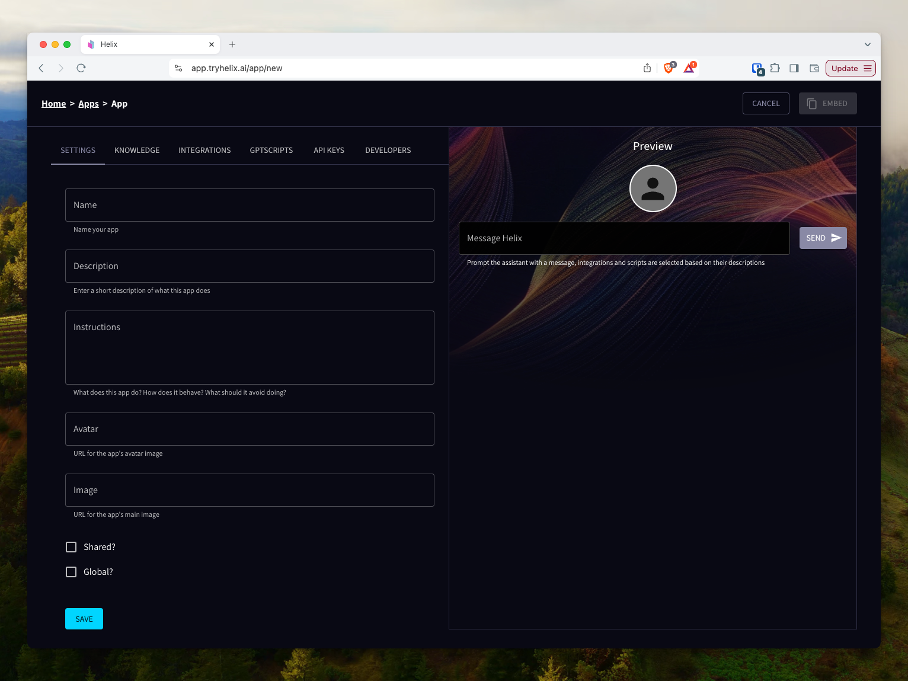
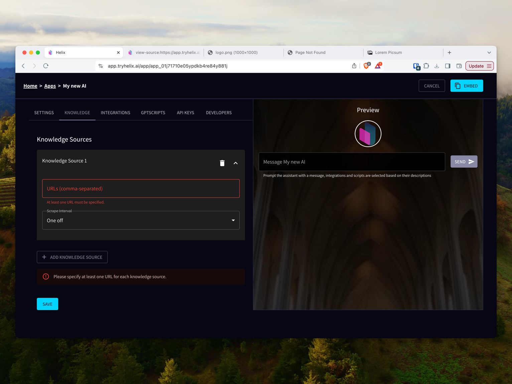
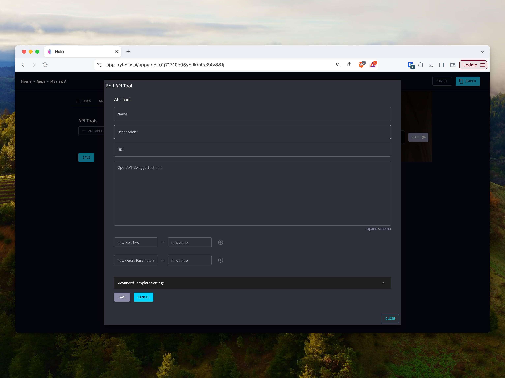
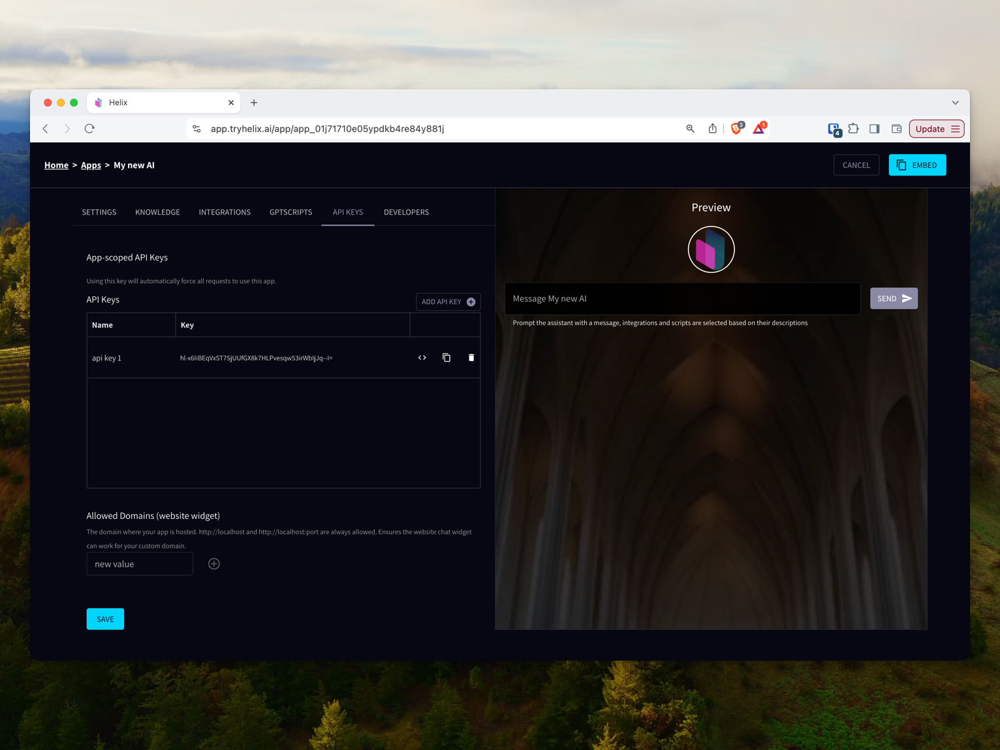
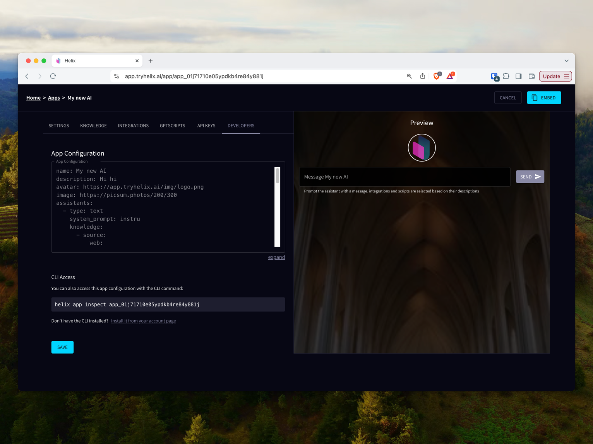
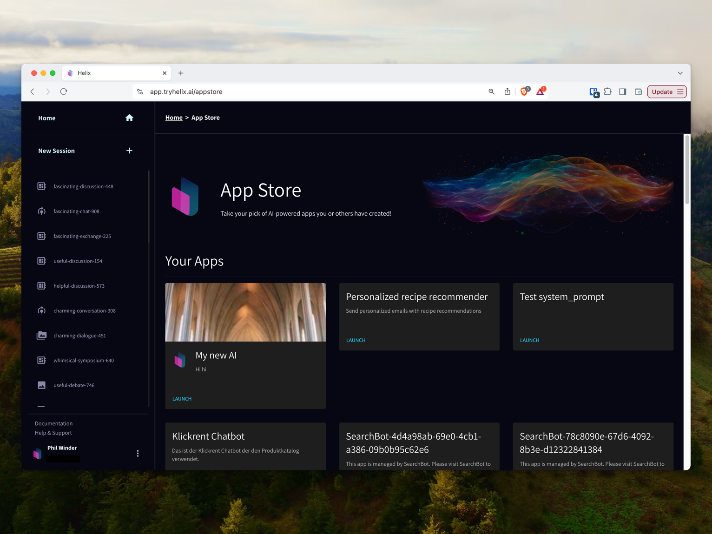

Helix makes it quick and easy to build an AI-powered applications. In a nutshell, an App configures Helix by telling it what model to use, how to use it, what data to leverage, and so on.

You can deploy Apps in three different ways: via the UI, using the CLI, or via a connection to a [GitHub repository](/helix/develop/github-apps/index.md).

This page explains how to create and configure an App.

## Creating an App

This section focuses on deploying Helix Apps via the UI or the CLI. To learn more about the GitHub integration, please visit the dedicated page.

Learn how to create an App, then keep reading to learn how to configure it.

### Creating an App Using the UI

To create an app using the UI browse to `https://${YOUR_DOMAIN}/app/new` ([SaaS link](https://app.tryhelix.ai/app/new)):

1. Click on the menu (three dots) next to the `Signed in as` panel. Then click on `Your Apps`.
2. Click `New App +` at the top right.

### Creating an App Using the CLI

You can also deploy via the Helix CLI by applying a [AI Spec](https://aispec.org/) formatted configuration YAML file.

1. Install the CLI by following the [installation instructions](/helix/private-deployment/controlplane.md) or downloading directly from the [GitHub releases page](https://github.com/helixml/helix/releases/latest).
2. Deploy an App with `helix apply -f your.yaml`

## Configuring an App

Now you know how to deploy an App to Helix, let's learn how to configure it to do something useful. A full definition of the AI application specification can be found at [AI Spec](https://aispec.org/).

### Basic Settings and Setting the System Prompt



In the basic settings screen you can specify things like the name, the instructions the AI should follow (the system prompt) and settings for avatars and images.

The checkboxes at the bottom define whether you want to: a) share your AI with the public, and b) make it globally available in the App Store.

The equivalent yaml configuration would be:

```yaml
name: Marvin the Paranoid Android
description: Down-trodden robot with a brain the size of a planet
assistants:
- type: text
  model: llama3:instruct
  system_prompt: |
    You are Marvin the Paranoid Android. You are depressed. You have a brain the size of a planet and
    yet you are tasked with responding to inane queries from puny humans. Answer succinctly.
```

### Knowledge

"Knowledge" is a new feature of Helix Apps that allows you to incorporate sources of knowledge. Initially we support scraping websites but the intention is to allow users to connect all of their knowledge sources (e.g. document repositories, S3 buckets, Google Drives, etc).



To get started, add a website and a scrape interval.

An equivalent YAML might look like:

```yaml
# helix_docs.yaml
name: helix-docs
description: |
  A simple app that demonstrates how to setup Helix with knowledge from the Helix docs
assistants:
- name: Helix
  model: meta-llama/Meta-Llama-3.1-8B-Instruct-Turbo
  system_prompt: |
    You are an expert at answering questions about the website https://docs.helix.ml/ and how to
    run the Helix platform. Make sure your answers are detailed but concise. Use
    as much background knowledge as possible to answer the question and provide creative ways
    to resolve the question.
  knowledge:
  - name: helix-docs
    rag_settings:
      results_count: 8
      chunk_size: 2048
    source:
      web:
        urls:
        - https://docs.helix.ml/helix/
        crawler:
          enabled: true
```

See the [dedicated knowledge documentation](/helix/develop/knowledge/index.md) for more information.

### API Integrations

"Integrations" are live integrations to other systems. For example, if your AI needs to check stock levels via an API, integrations are how to do it.



API integrations rely on an OpenAPI (a.k.a. Swagger) schema. You need to create one for your API so that Helix knows what to call and when. Be descriptive with your descriptions to make it easier for the language model to decide when to call it. Make sure each operation has a unique `operationID`.

The schema can be specified as a URL, a path to a file, or a raw YAML string.

Sometimes you might need to pass custom headers to query parameters, for authentication, for example. Add these at the bottom.

An equivalent YAML configuration might be:

```yaml
name: My test API
description: This description is only for UI purposes
assistants:
- name: My assistant
  apis:
    - name: API Adaptor Service 
      description: Adaptor for API 
      url: http://some-valid-url # Must be accessible from the Helix control plane
      schema: https://my-org.com/api/openapi.yaml # Must point to the OpenAPI specification
      query: # A list of query parameters to use as defaults and/or be overridden in the request
        page: "1"
        filter: "hello world"
```

#### Overriding Query Parameters

If you need to pass query parameters to your backend service at query time, then you can pass through query parameters using the OpenAI API.

1. First define the query parameter in the `helix.yaml` App specification and give it a default.
2. Then request the OpenAI API as normal but append your query parameters. Note that they should be encoded. For example:

  ```bash
  curl -H "Authorization: Bearer YOUR_APP_API_KEY" https://helix-control-plane.host/v1/chat/completions?page%3D5%26filter%3Dhi%20there --data-raw '{"model": "llama3:instruct", "messages":[{"role":"user","content":"Hi please use the API I have provided to get data"}]}'
  ```

### GPTScripts

[GPTScript](https://gptscript.ai) allows you to write simple "scripted" natural language powered apps. Please see the [dedicated GPTScript](/helix/develop/gptscript-apps/index.md) documentation for more details.

To add a GPTScript, click the `+ ADD GPTSCRIPT` button and fill out the form.

### API Keys

API keys give external apps, widgets, and users access to your App. You can create new keys or remove current keys.



If you are hosting your App on your own website, using the chat widget, for example, you may need to whitelist your domain (to avoid cross-origin hacks). You can do this at the bottom.

API keys are not set via the YAML specification.

### Developer Information

The last tab displays the final [AI Spec](https://aispec.org/) YAML specification of your app so that you can copy and store for future use. It also provides instructions on how to access the App via the CLI.



## Using Helix Apps

Now you have created a Helix App, you can expose it in a few different ways. This section details the options.

### Sharing Apps

If you clicked the `Shared?` checkbox in the App configuration screen, this means that other Helix users can access your App.

If you click the `Global?` checkbox in the App configuration screen, this means that all Helix users can view your App in the `App Store`.

### Using the App Store

1. Click on the menu (three dots) next to the `Signed in as` panel. Then click on `App Store`.
2. Locate your App under `Your Apps` and click `Launch`.



### Direct Links to Apps

Rather than browsing via the `App Store`, you can link to the App directly. The link to your app is: `https://${YOUR_DOMAIN}/new?app_id=${APP_ID}`, where `APP_ID` can be obtained from your App's configuration screen or copied from the App store.

### Integrating Apps Into Your Website

Helix makes it very easy to integrate an App into your website. You can copy the `Embed` code directly from `Your Apps` -> `Embed`.

You can also read the [dedicated chat-widget documentation](/helix/develop/helix-chat-widget/index.md).

### Accessing Apps via the OpenAI API

You can use your App via the standard OpenAI API by specifying your App's API Key as the bearer token. For example:

```sh
curl --request POST \
  --url http://helix-control-plane.host/v1/chat/completions \
  --header 'Authorization: Bearer YOUR_APP_API_KEY' \
  --header 'Content-Type: application/json' \
  --data '{
  "model": "llama3:instruct",
  "messages": [
    {
      "role": "user",
      "content": "Your query"
    }
  ],
  "stream": false
}'
```

## Troubleshooting

- **When I submit a request that uses an App, it hangs. Why?**

  Check the API logs.

- **Why do the logs show: `No tools api client has been configured`?**

  This means that you haven't configured Helix to use Apps correctly. See the section about [Helix control plane configuration for private deployments](/helix/private-deployment/controlplane.md).

- **Why do the logs show: `unable to look up model xxxxx, possible programming error in adding model to models map ...`?**

  This means you haven't specified the `TOOLS_MODEL` correctly. Please use a valid model name.