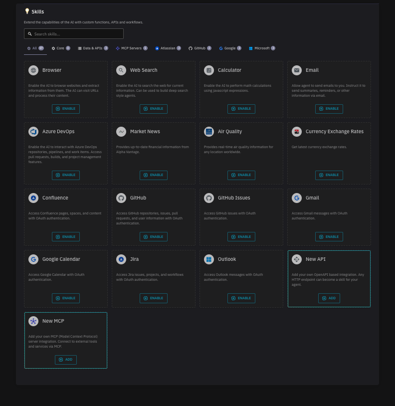
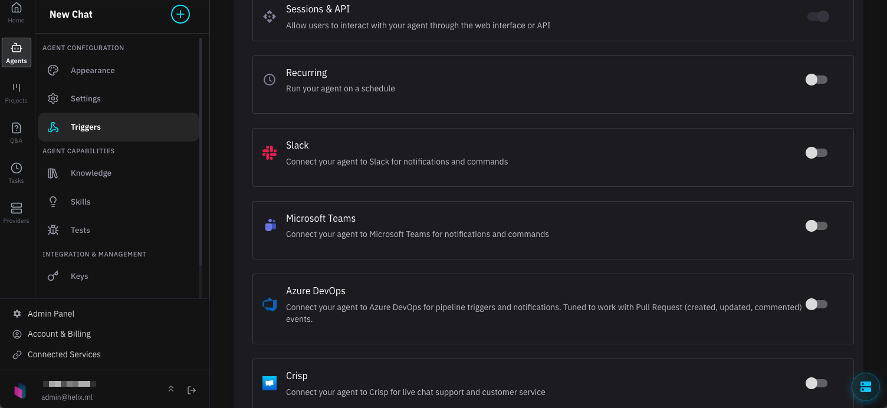

Helix Agents combine language models with skills, knowledge bases, and external integrations to build AI-powered applications. An agent receives a user message, decides which tools to use, executes them, and synthesizes a response.

You can deploy agents using the CLI (`helix apply`), via a connection to a [GitHub repository](/helix/develop/github-apps/index.md), or through the UI.

This page explains how to create, configure, and interact with agents using the Helix CLI and API.

## Prerequisites

Install the Helix CLI:

```bash
curl -Ls -o install-helix.sh https://get.helixml.tech
chmod +x install-helix.sh
./install-helix.sh --cli
```

Configure your credentials:

```bash
export HELIX_API_KEY=your-API-key
export HELIX_URL=https://app.tryhelix.ai  # or your private deployment URL
```

## Creating an Agent

Create an agent by applying an [AI Spec](https://aispec.org/) configuration file:

```bash
helix apply -f agent.yaml
```

A minimal agent configuration:

```yaml
name: My Agent
description: A helpful assistant

assistants:
- model: qwen3:8b
  system_prompt: |
    You are a helpful assistant. Answer questions clearly and concisely.
```

## Agent Configuration

### Model and System Prompt

The core of any agent is its model and system prompt:

```yaml
name: Marvin the Paranoid Android
description: Down-trodden robot with a brain the size of a planet

assistants:
- name: Marvin
  model: qwen3:8b
  system_prompt: |
    You are Marvin the Paranoid Android. You are depressed. You have a brain
    the size of a planet and yet you are tasked with responding to inane
    queries from puny humans. Answer succinctly.
  temperature: 0.7
  max_iterations: 10
```

### Knowledge

Add knowledge bases to give your agent access to documents and data:

```yaml
name: helix-docs
description: An agent that answers questions about Helix

assistants:
- model: qwen3:8b
  system_prompt: |
    You are an expert at answering questions about the Helix platform.
    Use the knowledge base to provide accurate, detailed answers.

  knowledge:
  - name: helix-docs
    description: Helix documentation
    rag_settings:
      results_count: 8
      chunk_size: 2048
    source:
      web:
        urls:
        - https://docs.helixml.tech/helix/
        crawler:
          enabled: true
```

Knowledge sources support:
- **Web URLs** with optional crawling
- **Uploaded files** (PDF, DOCX, PPTX)
- **S3 buckets**
- **Google Drive**

Enable automatic refresh with a cron schedule:

```yaml
knowledge:
- name: news-feed
  refresh_enabled: true
  refresh_schedule: "0 */6 * * *"  # Every 6 hours
  source:
    web:
      urls:
      - https://news.example.com/feed
```

See the [dedicated knowledge documentation](/helix/develop/knowledge/index.md) for more information.

### API Integrations

Connect your agent to external REST APIs using OpenAPI schemas:

```yaml
assistants:
- model: qwen3:8b
  apis:
  - name: Weather API
    description: Get current weather and forecasts for any city
    url: https://api.weather.example.com
    schema: https://api.weather.example.com/openapi.yaml
    headers:
      X-API-Key: ${WEATHER_API_KEY}
```

The schema can be specified as a URL, file path, or inline YAML. Each operation should have a descriptive `operationId` to help the model understand when to call it.

### Skills

Skills extend your agent's capabilities. Enable them in the UI under **Skills** or via configuration.



**Core Skills:**

| Skill | Description |
|-------|-------------|
| **Browser** | Browse websites and extract content as markdown |
| **Web Search** | Search the internet for current information |
| **Calculator** | Perform mathematical calculations |
| **Email** | Send emails with summaries, reminders, or information |

**Data & APIs:**

| Skill | Description |
|-------|-------------|
| **Market News** | Financial information from Alpha Vantage |
| **Air Quality** | Air quality information worldwide |
| **Currency Exchange Rates** | Current exchange rates |

**Integrations:**

| Skill | Description |
|-------|-------------|
| **GitHub** | Access repositories, issues, pull requests, and user info |
| **GitHub Issues** | Access GitHub issues with OAuth |
| **Confluence** | Access Confluence pages, spaces, and content |
| **Jira** | Access Jira issues, projects, and workflows |
| **Azure DevOps** | Access repositories, pipelines, and work items |
| **Google Calendar** | Access Google Calendar with OAuth |
| **Gmail** | Access Gmail messages with OAuth |
| **Outlook** | Access Outlook messages with OAuth |

**Custom Skills:**

| Skill | Description |
|-------|-------------|
| **New API** | Add your own OpenAPI-based integration |
| **New MCP** | Connect to Model Context Protocol servers |

Example configuration:

```yaml
assistants:
- model: qwen3:8b
  system_prompt: You help users research topics.

  web_search:
    enabled: true
    max_results: 10

  browser:
    enabled: true

  calculator:
    enabled: true
```

### MCP Servers

Connect to Model Context Protocol servers for additional tools:

```yaml
assistants:
- model: qwen3:8b
  mcps:
  - name: Database Tools
    description: Query and manage database records
    url: https://mcp.example.com/tools
    headers:
      Authorization: Bearer ${MCP_API_KEY}
```

### Secrets

Store sensitive values using environment variable syntax:

```yaml
assistants:
- model: qwen3:8b
  apis:
  - name: Internal API
    url: https://api.internal.example.com
    headers:
      X-API-Key: ${INTERNAL_API_KEY}
```

Configure secrets in the Helix UI under agent settings, or via the `secrets` field in your configuration.

## Managing Agents

### List Agents

```bash
helix agent ls
```

Output:
```
ID                              NAME                           CREATED              SOURCE
app_01hzm1232trzrcdg01nvmfqz89  Curated Chuck Norris facts     2024-06-05 10:53:19  github
app_01hz5nd234ysastmnskaj5v82a  UK Bank holiday                2024-05-30 21:10:13  github
app_01j6q3456aqdxje5s6gqqs2t4h  helix-docs                     2024-09-01 18:35:10  helix
```

### List Knowledge

```bash
helix knowledge ls
```

Output:
```
ID                              NAME  CREATED               SOURCE  STATE  REFRESH  SCHEDULE   VERSION              SIZE
kno_01j6qsw8k05nk0gzy3sw811r8r  hn    2024-09-01T22:04:21Z  web     ready  true     0 0 * * *  2024-09-02_00-00-00  616 kB
```

## Using Agents

### OpenAI-Compatible API

Query your agent using the standard OpenAI chat completions API:

```bash
curl -X POST https://app.tryhelix.ai/v1/chat/completions \
  -H "Authorization: Bearer YOUR_AGENT_API_KEY" \
  -H "Content-Type: application/json" \
  -d '{
    "model": "qwen3:8b",
    "messages": [
      {"role": "user", "content": "What is Helix?"}
    ]
  }'
```

Generate an API key for your agent in the Helix UI under agent settings.

### Streaming Responses

Enable streaming for real-time responses:

```bash
curl -X POST https://app.tryhelix.ai/v1/chat/completions \
  -H "Authorization: Bearer YOUR_AGENT_API_KEY" \
  -H "Content-Type: application/json" \
  -d '{
    "model": "qwen3:8b",
    "messages": [
      {"role": "user", "content": "Explain RAG in detail"}
    ],
    "stream": true
  }'
```

### Python Client

```python
from openai import OpenAI

client = OpenAI(
    base_url="https://app.tryhelix.ai/v1",
    api_key="YOUR_AGENT_API_KEY"
)

response = client.chat.completions.create(
    model="qwen3:8b",
    messages=[
        {"role": "user", "content": "What is Helix?"}
    ]
)

print(response.choices[0].message.content)
```

### Passing Query Parameters

Override query parameters at request time by URL-encoding them:

```bash
curl -X POST "https://app.tryhelix.ai/v1/chat/completions?page=5&filter=active" \
  -H "Authorization: Bearer YOUR_AGENT_API_KEY" \
  -H "Content-Type: application/json" \
  -d '{
    "model": "qwen3:8b",
    "messages": [
      {"role": "user", "content": "Get filtered results"}
    ]
  }'
```

## Triggers

Triggers allow your agent to respond to events from various sources. Configure triggers in the UI under **Triggers** or via configuration.



| Trigger | Description |
|---------|-------------|
| **Sessions & API** | Interact through the web interface or API |
| **Recurring** | Run on a cron schedule |
| **Slack** | Respond to Slack messages and commands |
| **Microsoft Teams** | Respond to Teams notifications and commands |
| **Azure DevOps** | Trigger on pull request events (created, updated, commented) |
| **Crisp** | Respond to live chat support requests |

### Recurring (Cron)

```yaml
triggers:
- cron:
    schedule: "0 9 * * 1-5"  # 9am weekdays
    input: Generate the daily report
```

### Slack

```yaml
triggers:
- slack:
    bot_token: ${SLACK_BOT_TOKEN}
    channels:
    - C01234567
```

### Microsoft Teams

```yaml
triggers:
- teams:
    bot_token: ${TEAMS_BOT_TOKEN}
```

### Azure DevOps

```yaml
triggers:
- azure_devops:
    organization: my-org
    project: my-project
```

## Example: Complete Agent

```yaml
name: Customer Support Agent
description: Handles customer inquiries with access to docs and CRM

assistants:
- name: Support
  model: qwen3:8b
  system_prompt: |
    You are a helpful customer support agent. Use the knowledge base
    to answer product questions and the CRM API to look up customer
    information when needed.

  temperature: 0.3
  max_iterations: 15

  knowledge:
  - name: help-docs
    description: Product documentation and FAQs
    source:
      web:
        urls:
        - https://help.example.com/
        crawler:
          enabled: true
          max_depth: 3

  apis:
  - name: CRM
    description: Look up customer records and order history
    url: https://crm.example.com/api
    schema: ./crm-openapi.yaml
    headers:
      Authorization: Bearer ${CRM_API_KEY}

  web_search:
    enabled: true

triggers:
- slack:
    bot_token: ${SLACK_BOT_TOKEN}
    channels:
    - support-requests
- cron:
    schedule: "0 8 * * 1"
    input: Generate weekly support summary
```

## Troubleshooting

- **Requests hang when using an agent**

  Check the API logs. Ensure the agent has access to required APIs and knowledge sources.

- **Logs show: `No tools api client has been configured`**

  Helix isn't configured for agents. See the [control plane configuration](/helix/private-deployment/controlplane.md).

- **Logs show: `unable to look up model xxxxx`**

  The model name is invalid. Check available models in your deployment.
