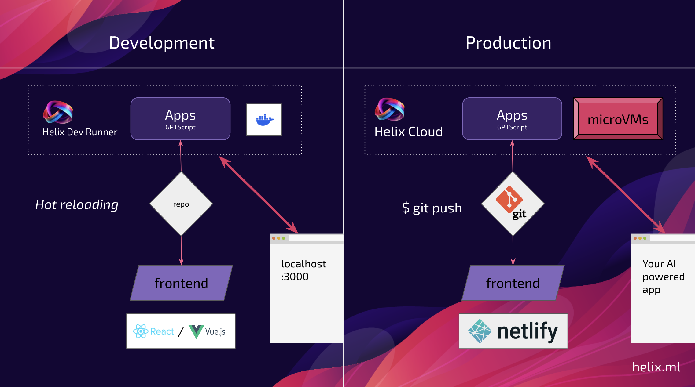

Helix supports [GPTScript](https://gptscript.ai) to create scripted natural language workflows. GPTScript lets you write prompts that can call tools, read files, and chain operations together.

Also see the [GPTScript example agents](/helix/examples/apps/gptscript-app-recommendations/index.md).

## How It Works

GPTScripts run securely in isolated containers. You can develop locally with the Helix GPTScript Dev Server, then deploy via `git push` to your connected repository.



## JavaScript Client

Install the **[@helixml/apps-client](https://www.npmjs.com/package/@helixml/apps-client)** package:

```bash
npm i @helixml/apps-client
```

Initialize the client with your agent's API key:

```js
import AppClient from '@helixml/apps-client'

const appClient = AppClient({
  token: "YOUR_AGENT_API_KEY",
})
```

Get your API key from the **Keys** section in your agent settings.

Call a GPTScript from your application:

```js
const result = await appClient.runScript({
  file_path: '/gptscripts/recipe.gpt',
  input: `--user_id '${userId}' --count '5' --theme '${theme}'`,
})
```

## Writing GPTScripts

GPTScripts declare tools, arguments, and natural language instructions. Here's an example that generates personalized recipe recommendations:

`gptscripts/recipe.gpt`:

```
tools: recipe.query, purchases.query, sys.read
args: user_id: The user ID to get recommendations for
args: theme: The theme of recipes to suggest
args: count: Number of recipes to return

Do the following steps sequentially:
  1. Run {recipe.query} to get candidate recipes, written to recipes.csv
  2. Run {purchases.query} to get the user's top 10 purchased products, written to purchases.csv
  3. Read recipes.csv and purchases.csv, then output {count} {theme}-themed recipes
     the user would likely enjoy based on their purchase history

Output format (use exact image URLs from the CSV, do not invent URLs):

[{
  "name": "Recipe Name",
  "summary": "Brief description",
  "imageUrl": "https://..."
}]
```

## Agent Configuration

Add GPTScripts to your agent's `helix.yaml`:

```yaml
name: Recipe Agent
description: Personalized recipe recommendations

assistants:
- model: qwen3:8b
  gptscripts:
  - name: recipe-suggestions
    file: gptscripts/recipe.gpt
    description: Get personalized recipe recommendations
```

Or specify a glob pattern:

```yaml
gptscript:
  files:
  - gptscripts/*.gpt
```

## Tool Definitions

Define custom tools within your GPTScript. This example queries SQLite and writes results to a file:

```
---
name: purchases.query
tools: sys.exec
description: Query top 10 products purchased by user_id, output to purchases.csv
args: user_id: The user ID to query

sqlite3 recipes.sqlite <<EOF
.headers on
.mode csv
.output purchases.csv
SELECT product, quantity
FROM Purchases
WHERE user_id = '${user_id}'
ORDER BY quantity DESC
LIMIT 10;
EOF
```

## Tips

**Use files for intermediate data**: Have tools write output to files rather than returning it directly. This avoids the LLM summarizing raw data when you just need to pass it to the next step.

```
# Good: Write to file, read in next step
.output results.csv
SELECT ...

# Avoid: LLM will try to summarize/format the raw output
```

**Request structured output**: Ask for JSON output explicitly, then parse it in your application code.

**Chain operations sequentially**: Use numbered steps to ensure operations happen in order.
