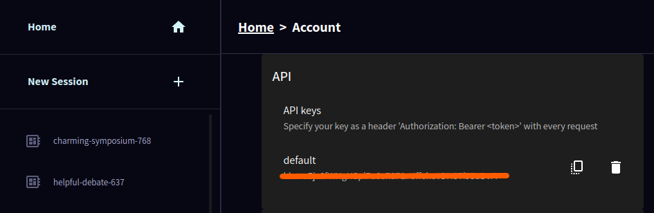

The Helix Chat Widget is a UI component that makes it easy to expose Helix models in your apps and on your website. It is packaged both as a React component and a browser-side library.

## Embedding the Helix Chat Widget in Your Web Page

To embed the Helix Chat Widget in your web page:

Load the library from a CDN by including the script tag in the `<head>` section of your HTML file:

```html
<script src="https://cdn.jsdelivr.net/npm/@helixml/chat-embed"></script>
```
<br>

You can find the full list of versions on [jsdelivr](https://www.jsdelivr.com/package/npm/@helixml/chat-embed). You can use [srihash.org](https://www.srihash.org/) to calculate the integrity hash, just enter the full version URL and they will give you the hash. For using the widget in production you must specify the version number and integrity as below.

```html
<script
    src="https://cdn.jsdelivr.net/npm/@helixml/chat-embed@0.3.4"
    integrity="sha384-882TSV27WpFcIqxIAm0QjkgREhy6XdN9L2HRB2z+FtbIyuUBrEkJ8QJgtnvx1bZT"
    crossorigin="anonymous"
>
</script>
```
<br>
Add a div element with the id `chat-widget` where you want the widget to appear:

```html
<div id="chat-widget"></div>
```
<br>

Initialize the Chat Widget by calling the global `ChatWidget` function with your configuration:

```js
ChatWidget({
    url: 'https://app.tryhelix.ai/v1/chat/completions',
    model: 'llama3:instruct',
    bearerToken: 'your_bearer_token_here',
})
```
<br>

Replace `'your_bearer_token_here'` with your actual bearer token. You will find your bearer token in the Helix Console under My Account.



### Example

<!-- Explain what you are going to code before giving the code solution -->
This example shows the Helix Chat Widget integrated with <a href="https://docs.helix.ml/helix/develop/helix-tools-example/" target="_self">Helix API Tools</a> to provide a seamless experience.

When the rendered search widget is clicked.


The Helix Chat widget opens and the user can input their query.


The widget will then display the response from the Helix model.


<br>

## Embedding the Helix Chat Widget in Your React App

### React Component Usage

The `@helixml/chat-widget` is a highly customizable React component designed to provide interactive chat functionality within your application. It features a minimalist design that opens a modal window upon interaction, where users can submit questions and receive answers from a specified openAI compatible endpoint.

#### Installation

To use the `@helixml/chat-widget` in your project, install it via npm:

```bash
npm install @helixml/chat-widget
```
<br>

or using yarn:

```bash
yarn add @helixml/chat-widget
```
<br>

### Usage

Import and use the `Widget` component in your React application:

```jsx
import React from 'react';
import Widget from '@helixml/chat-widget';

function App() {
  return (
    <div className="App">
      <Widget
        url="https://app.tryhelix.ai/v1/chat/completions"
        model="my_model_name"
        windowTheme={{ /* Optional window theme overrides */ }}
        searchTheme={{ /* Optional search theme overrides */ }}
      />
    </div>
  );
}

export default App;
```
<br>

## Customising the Helix Chat Widget

You can customize the appearance and behavior of the Chat Widget by passing additional options to the `ChatWidget` function. This includes theme options to style the chat window and search input:

#### Props

- `url`: String. The endpoint URL for the remote API from which the answers will be fetched.
- `model`: String. Identifier for the specific model to be queried at the remote API.
- `bearerToken`: (Optional) String. Bearer token for authentication with the remote API, if required.
- `title`: (Optional) String. Title text for the chat window.
- `logo`: (Optional) String. URL of the logo image to display in the header.
- `placeholder`: (Optional) String. Placeholder text for the search input.
- `windowTheme`: (Optional) Object. Theme customization for the window component. See the Theme Customization section below for details.
- `searchTheme`: (Optional) Object. Theme customization for the search input. See the Theme Customization section below for details.

### Theme Customization

Customize the appearance of the chat widget and its components using the `windowTheme` and `searchTheme` props. Each theme object allows you to override default styles to match your application's design.

#### Window Theme Options

- `logoWidth`: Width of the logo inside the header.
- `backdropColor`: Color of the modal backdrop.
- `backgroundColor`: Background color of the window.
- `width`: Width of the window.
- `verticalMargin`: Vertical margin of the window.
- `borderRadius`: Border radius of the window.
- `shadow`: Box shadow for the window.
- `fontFamily`: Font family for text inside the window.
- `headerTextColor`: Text color for the header.
- `headerFontSize`: Font size for the header text.
- `headerPadding`: Padding inside the header.
- `errorTextColor`: Text color for error messages.
- `errorFontSize`: Font size for error messages.
- `contentBoxShadow`: Box shadow for the content area inside the window.
- `contentPadding`: Padding inside the content area.
- `replyTextColor`: Text color for the reply messages.
- `replyFontSize`: Font size for the reply messages.
- `subtitleTextColor`: Text color for subtitles.
- `subtitleFontSize`: Font size for subtitles.
- `footerPadding`: Padding inside the footer.
- `closeButtonBorderRadius`: Border radius of the close button.
- `closeButtonColor`: Color of the close button.
- `closeButtonPadding`: Padding of the close button.
- `closeButtonFontSize`: Font size of the close button text.

#### Search Theme Options

- `borderColor`: Border color of the search input.
- `backgroundColor`: Background color of the search input.
- `hoverBorderColor`: Border color of the search input on hover.
- `borderRadius`: Border radius of the search input.
- `iconPadding`: Padding around the search icon.
- `iconColor`: Color of the search icon.
- `textPadding`: Padding inside the search input for text.
- `textSize`: Font size of the text inside the search input.
- `fontFamily`: Font family of the search input text.
