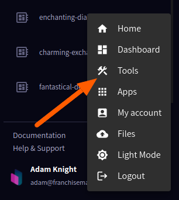
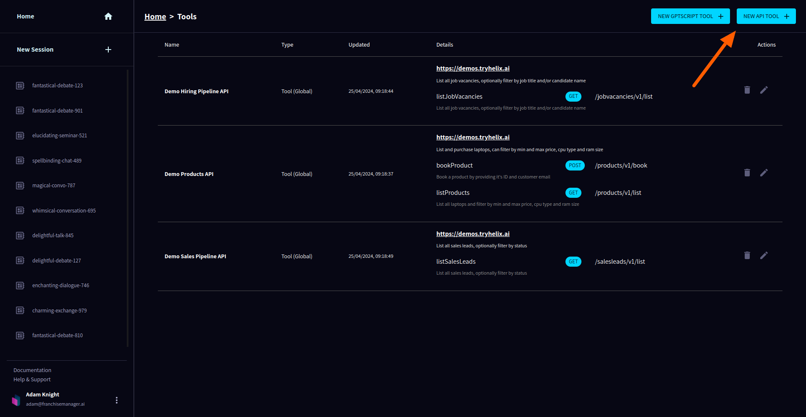
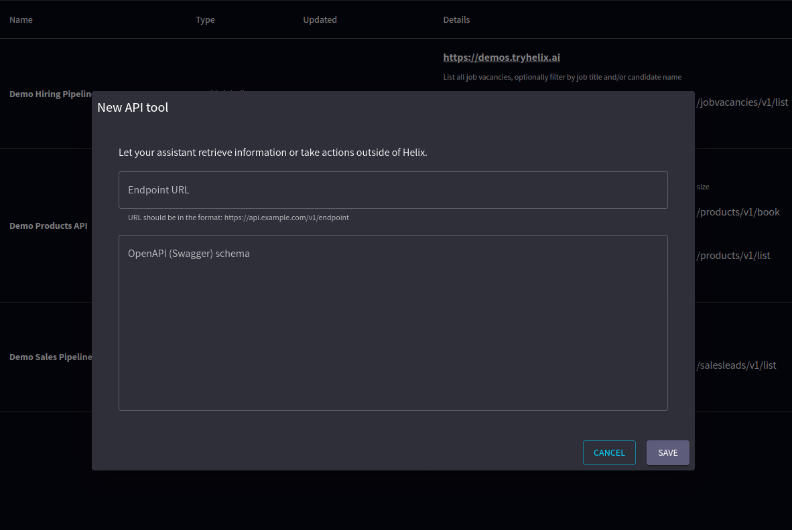
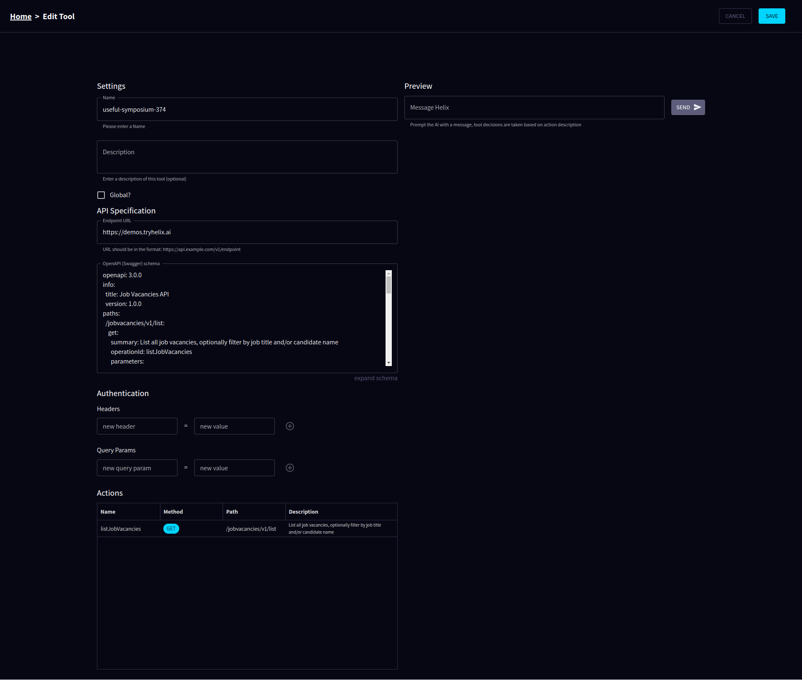
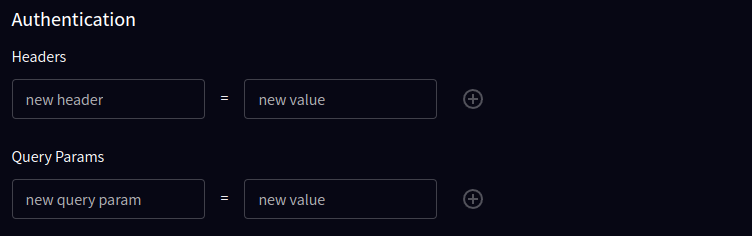
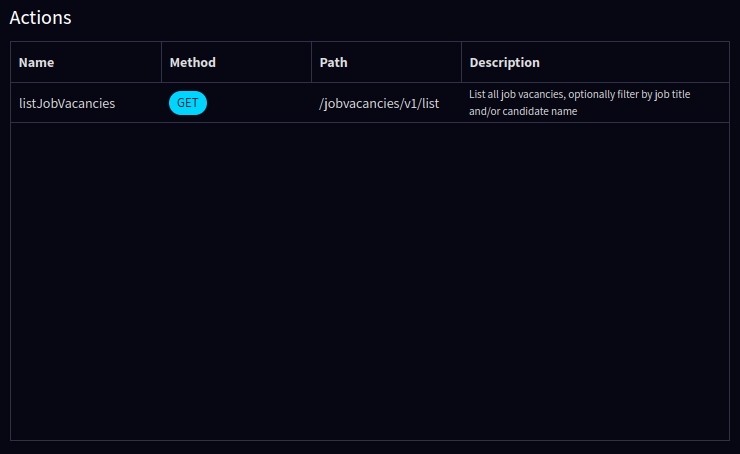
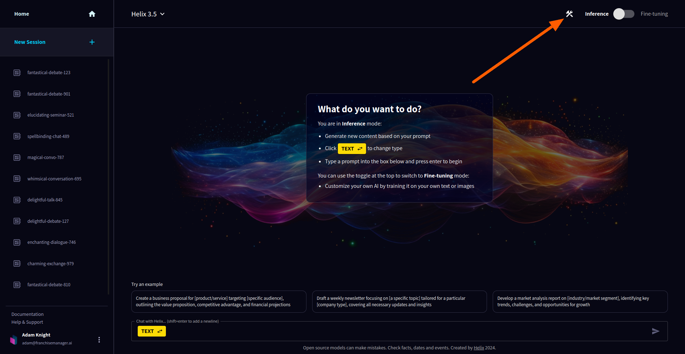
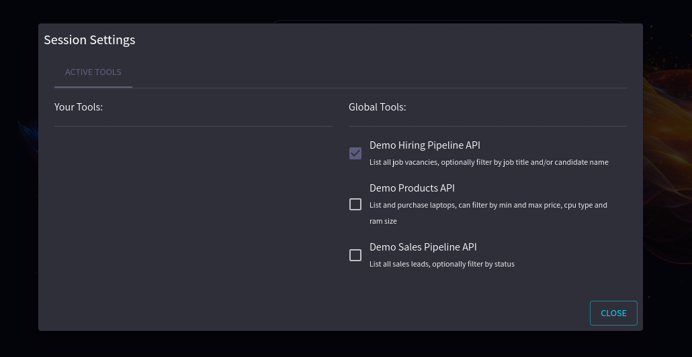

This page describes how to set up and manage a Helix API Tool within the Helix platform.

To create an API Tool in Helix, you need to provide the API Endpoint and an OpenAPI (Swagger) schema that describes the API's functionality. This schema defines the endpoints, parameters, responses, and data structures that your API Tool will interact with.

## Creating the API Tool in Helix

To create a new API tool in the Helix platform, follow these steps:

### 1. Get started
Navigate to the API Tools section in the Helix platform.


### 2. Helix Tools Page
Click on the "Add New API Tool" button.


### 3. Create your API Tool
Enter the API Endpoint URL and OpenAPI Swagger schema for your new API tool. Click the "Save" button to create your new API tool.


#### Swagger OpenAPI Schema

[https://github.com/helixml/example-helix-app/blob/main/openapi/jobvacancies.yaml](https://github.com/helixml/example-helix-app/blob/main/openapi/jobvacancies.yaml)

```yaml
openapi: 3.0.0
info:
  title: Job Vacancies API
  version: 1.0.0
paths:
  /jobvacancies/v1/list:
    get:
      summary: List all job vacancies, optionally filter by job title and/or candidate name
      operationId: listJobVacancies
      parameters:
        - in: query
          name: job_title
          schema:
            type: string
          required: false
          description: Filter vacancies by job title
        - in: query
          name: candidate_name
          schema:
            type: string
          required: false
          description: Filter vacancies by candidate name
      responses:
        '200':
          description: An array of job vacancies, each with details including ID, name, email, job title, job description, and CV
          content:
            application/json:
              schema:
                type: array
                items:
                  $ref: '#/components/schemas/JobVacancyCandidate'
components:
  schemas:
    JobVacancyCandidate:
      type: object
      properties:
        id:
          type: string
        name:
          type: string
        email:
          type: string
        jobTitle:
          type: string
        jobDescription:
          type: string
        CV:
          type: string
```

### 4. Configuration
Your API Tool will be created and you will be redirected to the API Tool's details page. You now need to give your tool a name and a description. It is important to provide an accurate name and description so that Helix's models can understand the purpose of your tool and use it correctly.


### 5. Authentication
If the API you are using requires authentication, you can configure the necessary headers and query parameters in the Authentication section. Once you have added your values click the plus icon to add and save them.


### 6. Actions
The actions section allows you to see the actions available defined in your Swagger schema.


### 7. Testing
Preview your tool by sending a message and seeing the response.


## Using your tool in Helix sessions

To use your your API Tool in a Helix session. Click the Tool icon in the toolbar and from the resulting modal select which tool(s) you want to make available to the Helix model.




Once your tools are selected just ask your question and Helix will use the tools to help answer your question.

