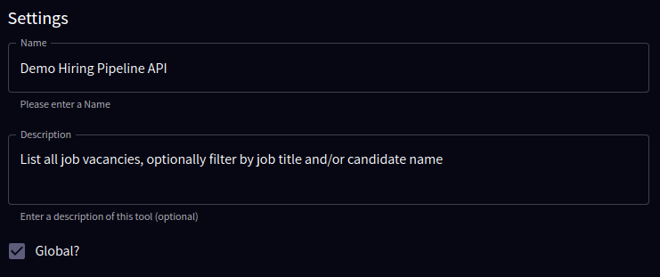
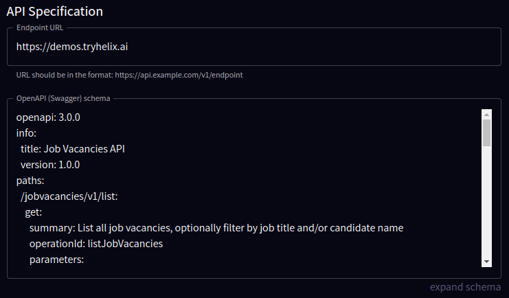

This page describes Helix API Tools and how to set up and manage tools within the Helix platform.

## Helix API Tools Architecture

### Components

#### Helix Control Plane

- **Function**: Manages and orchestrates the workflow
- **Role**: Initiates API calls on behalf of the user based on the outputs generated by the GPU Runner
- **Key Process**: 
  - Utilizes an API call executor to communicate with various APIs

#### GPU Runner

- **Function**: Executes specific AI tasks using high-performance GPUs
- **Role**: Processes prompts through different AI tools and models
- **Integrated Models**:
  - **Helix 3.5**: Utilizes Llama3-8B for fast and efficient performance, ideal for everyday tasks.
  - **Helix 4**: Powered by Llama3-70B, this model offers deeper insights and although a bit slower, it's smarter for complex queries.
  - **Helix Code**: Features CodeLlama-70B from Meta, which excels in programming and coding tasks, surpassing the capabilities of GPT-4 in software development contexts.
  - **Helix JSON**: Operates on Nous Hermes 2 Pro 7B, specialized for function calling and generating JSON outputs, enhancing automation and integration tasks.
- **Key Processes**:
  - Tools Classifier: Classifies the necessary tools required for the task
  - API Call Builder: Constructs API call requests based on the classified tools

### Workflow 

#### Prompt Execution

1. The GPU Runner receives prompts and processes them using the Tools Classifier and API Call Builder
2. Depending on the classification, appropriate tools are employed to build API calls

#### Control Plane Interaction

1. The Helix Control Plane receives the built API calls from the GPU Runner
2. It then uses the API call executor to interact with the required APIs

#### Result Summarization

Although not shown in the diagram, the Large Language Model (LLM) also plays a crucial role by:
- Summarizing the responses from the APIs 
- Delivering the summaries back to the user

### Summary

This architecture ensures efficient task management and execution by leveraging specialized models and tools, thereby enabling Helix AI to provide accurate and quick responses to user queries.

  

## What is an API Tool?

An API (Application Programming Interface) tool in the context of the Helix platform is a powerful feature that allows you to:

- Augment and enhance the capabilities of your AI models 
- Integrate external data and functionality

## Why are API Tools Useful?

API tools are incredibly useful for several reasons:

1. **Expanded Knowledge**: By connecting to external APIs, your AI can access vast amounts of up-to-date information that may not be present in its training data. This allows the AI to provide more accurate, relevant, and timely responses to user queries.

2. **Specialized Functionality**: APIs often provide specialized functionality that can be leveraged by your AI. For example:
   - Integrating a weather API allows your AI to provide current weather information
   - A language translation API enables multi-lingual capabilities

3. **Dynamic Responses**: With API tools, your AI can generate dynamic responses based on real-time data. This makes the AI more engaging and useful, as it can provide information that is tailored to the user's specific context and needs.

4. **Efficiency**: Instead of trying to encode all possible information and functionality into your AI model, API tools allow you to efficiently access external resources as needed. This keeps your AI model lean and focused, while still being able to handle a wide range of queries.

## How API Tools Work

At a high level, API tools in Helix work as follows:

1. You define an API tool by providing:
   - The API endpoint URL 
   - The OpenAPI (Swagger) schema that describes the API's functionality

2. When a user interacts with your AI model, the AI can recognize when a query could be best handled by an API tool based on predefined action descriptions.

3. The AI constructs the appropriate API request using the provided schema, sends the request to the API endpoint, and receives the response.

4. The AI then incorporates the API response into its overall response to the user, providing a seamless and integrated experience.

In essence, API tools allow you to create "API augmented generation" capabilities for your AI, similar to how "retrieval augmented generation" enhances AI models with external knowledge retrieval. 

By leveraging the power of APIs, you can create AI experiences that are more knowledgeable, capable, and engaging.

  

# API Tool Configuration

The API Tool Configuration screen allows you to set up and manage your API tools within the Helix platform. This guide will walk you through the various sections and options available on this screen.

## Basic Information

In the basic information section, you can provide the following details about your API tool:

- **Name**: Enter a name for your API tool. This is a required field.
- **Description**: Provide a description of your API tool. This is also a required field.
- **Global**: If you are an admin or the tool is global, you can check the "Global" checkbox to make the tool accessible to all users.

## API Specification

If your tool is configured to use an API, you will see the API Specification section. Here you can define the details of your API:

- **Endpoint URL**: Enter the URL of your API endpoint. This should be in the format `https://api.example.com/v1/endpoint`. This is a required field if your tool uses an API.
- **OpenAPI (Swagger) Schema**: Paste your API's OpenAPI (Swagger) schema here. You can click the "Expand" link to open a larger window for editing the schema. This is a required field if your tool uses an API.

## Authentication

In the Authentication section, you can specify the headers and query parameters required for your API requests:

- **Headers**: Add any necessary headers for your API requests. Click the "Add header" button to add a new header field.
- **Query Params**: Add any required query parameters for your API requests. Click the "Add query param" button to add a new query parameter field.

## Actions

This section displays a grid of the available actions for your API tool.

## Preview

Tool Prompt Preview

Tool Answer Preview

The Preview section allows you to test your API tool by sending a message and seeing the response:

1. Enter a message in the "Message Helix" text field.
2. Click the "Send" button to send the message and see the AI's response based on the tool's action descriptions.

## Saving and Canceling

At the bottom of the screen, you have the following options:

- **Cancel**: Click the "Cancel" button to cancel any changes and navigate back to the tools list.
- **Save**: Click the "Save" button to save your API tool configuration. If there are any validation errors, they will be displayed, and you will need to fix them before saving.

