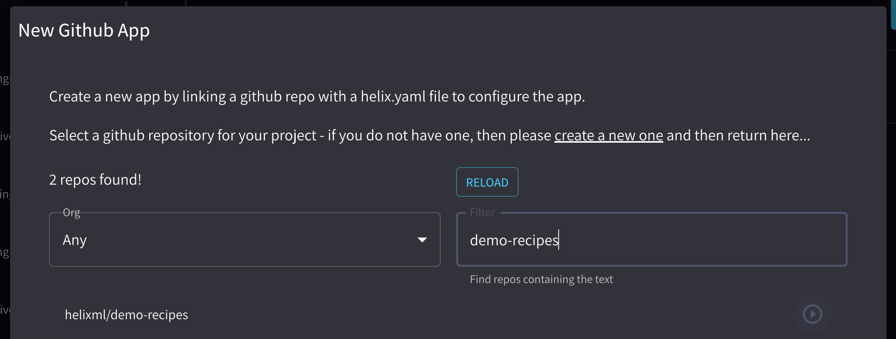
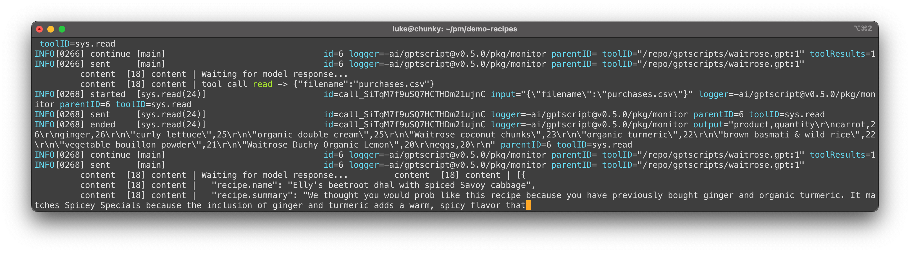

You can use this sample React app as a starting point for your own AI-powered applications.


## Step 1: Fork the Example Repo

Go to GitHub and fork [github.com/helixml/demo-recipes](https://github.com/helixml/demo-recipes).

## Step 2: Connect the Repo to Helix

In the Helix UI, go to **Agents** and click **New Agent**. Select **Connect GitHub Repository**.

Connect to your GitHub account, then select your fork from the dropdown:



Click **Connect Repo**.

This sets up a deploy key and webhooks so Helix can read the repo contents (even if private) and automatically deploy changes when you push.

## Step 3: Deploy the Frontend

Deploy the frontend app to a web server of your choice (Netlify, Vercel, or your own platform).

You can skip this step if you just want to test local development.

## Step 4: Local Development

Clone the repo locally, [get an API key from OpenAI](https://github.com/gptscript-ai/gptscript?tab=readme-ov-file#2-get-an-api-key-from-openai), then run:

```bash
bash helix-server.sh
```

This starts the Helix dev server, which runs GPTScript in a container locally.

The `apps-client` JS library automatically connects to the GPTScript dev server when running locally.

Start the frontend:

```bash
yarn install
yarn start
```

The app opens in your browser:


Enter your name in the box to test the "hello world" script (`gptscripts/welcome.gpt`):

```
description: Returns back the input of the script
args: input: Any string
echo "Welcome ${input}!"
```

This returns "Welcome, yourname".

Now enter either `alice@alice.com` or `bob@bob.com` (users in the bundled SQLite database) and select a recipe type to get recommendations based on their purchase history.

Watch the Helix dev server to see GPTScript processing:



## Step 5: Deploy to Production

With your fork connected to both an external hosting service (Netlify/Vercel) and Helix, you can deploy changes with a simple push.

Try changing something in `waitrose.gpt`, then:

```bash
git commit -am "update recipe wording"
git push
```

Helix receives the webhook and immediately deploys the updated GPTScript.

## Step 6: Customize for Your Use Case

You've seen how to build an AI-powered app with JavaScript and natural language. Start customizing for your own use cases.

## Questions?

Join us on [Discord](https://discord.gg/VJftd844GE) to share what you build!
