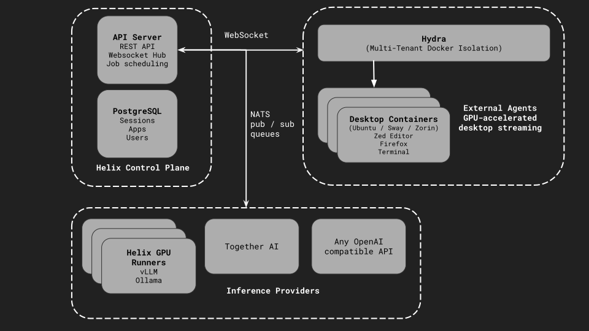

Helix is built on a modular architecture that separates the control plane from compute resources, enabling flexible deployment across different environments.

## High-Level Architecture

## Core Components

### Control Plane

The control plane orchestrates all Helix operations. The **API Server**, written in Go, exposes a RESTful API and maintains WebSocket connections for real-time updates. It handles job scheduling, queue management, and serves as a reverse proxy for frontend assets.

The **Frontend** is a React/TypeScript application providing the chat interface for AI interactions, app and session management, and a WebSocket-based desktop streaming viewer.

**PostgreSQL** stores sessions, conversations, app configurations, and user data. Authentication supports both built-in mode and integration with external OIDC providers for enterprise SSO.

### Runners

Runners provide GPU compute for inference and fine-tuning. They connect to the control plane via outbound WebSocket, which means they work behind NAT without exposing ports. Each runner reports available GPU memory and accepts jobs that fit. Models run through [Ollama](https://ollama.com) or [vLLM](https://github.com/vllm-project/vllm), with support for multiple concurrent instances based on available memory.

### External Agent Sandbox

The sandbox provides isolated environments for AI agents to work autonomously.

**Wolf** handles GPU-accelerated desktop streaming using NVIDIA hardware encoding (H.264/HEVC/AV1) and the Moonlight protocol for low-latency delivery. It runs in a Docker-in-Docker architecture for container management.

Desktop streaming uses WebSocket-only transport for enterprise compatibility—all traffic flows through standard HTTPS on port 443, with no WebRTC or TURN servers required. The browser decodes video using the WebCodecs API.

**Hydra** provides per-session Docker isolation. Each user gets their own dockerd instance with isolated networks, so sessions cannot see each other's containers. A veth bridge injection allows desktops to reach user containers, and custom DNS resolution ensures container names resolve correctly within sessions. Enterprise DNS servers and private TLDs are fully supported.

Multiple desktop environments are available: Sway (native Wayland, lightweight), Ubuntu (X11 via Xwayland, full GNOME), and Zorin (X11 via Xwayland, user-friendly). Each desktop comes with Zed editor, Firefox, Docker CLI, and Git pre-installed.

## Enterprise Deployment Considerations

Helix is designed for enterprise environments:

- **L7 Load Balancer Compatible** - All traffic over HTTP/HTTPS
- **Internal DNS Support** - Works with enterprise DNS servers
- **Proxy Support** - Respects `HTTP_PROXY`/`HTTPS_PROXY`
- **Private CA Certificates** - Support for internal TLS certificates
- **Network Segmentation** - Configurable endpoints for different network zones

## Related Resources

- [Docker Compose Configuration](https://github.com/helixml/helix/blob/main/docker-compose.yaml)
- [Helm Charts](https://github.com/helixml/helix/tree/main/charts)
- [Private Deployment Guide](/helix/private-deployment/)
