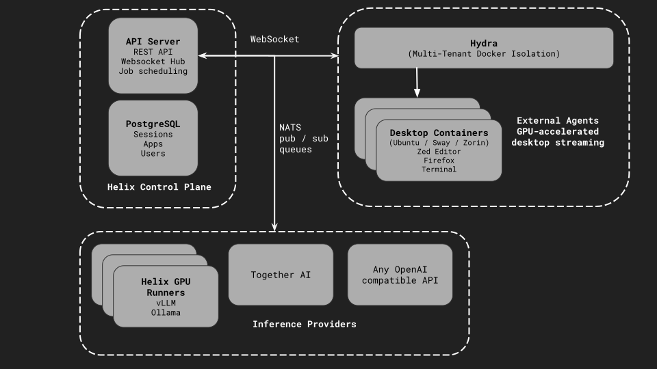

Helix is built on a modular architecture that separates the control plane from compute resources, enabling flexible deployment across different environments.

## High-Level Architecture

## Core Components

### Control Plane

The control plane orchestrates all Helix operations. The **API Server**, written in Go, exposes a RESTful API and maintains WebSocket connections for real-time updates. It handles job scheduling, routes AI requests to available runners, and manages user sessions.

The **Frontend** is a React/TypeScript application providing the chat interface for AI interactions, app and session management, and a WebSocket-based desktop streaming viewer for Helix Code sessions.

**PostgreSQL** stores sessions, conversations, app configurations, and user data. Authentication supports both built-in mode and integration with external OIDC providers for enterprise SSO.

### Runners

Runners provide GPU compute for AI inference. They connect to the control plane using **reverse WebSocket tunneling**—the runner initiates an outbound connection, then the control plane sends requests back through that tunnel. This means runners work behind NAT and firewalls without exposing any ports.

Each runner reports its available GPU memory and model capabilities. The control plane routes inference requests to runners with the appropriate models loaded. Models run through [Ollama](https://ollama.com) or [vLLM](https://github.com/vllm-project/vllm), supporting multiple concurrent model instances based on available GPU memory.

Runners can be deployed anywhere—on-premises, in the cloud, or across multiple data centers—as long as they can reach the control plane over HTTPS.

### Knowledge & RAG

Helix includes a complete RAG (Retrieval-Augmented Generation) pipeline:

- **Typesense** provides fast full-text search for documents and knowledge bases
- **Kodit** indexes code repositories, enabling AI agents to search and understand your codebase
- **Haystack** (optional) adds vector embeddings for semantic search using pgvector

Documents are automatically chunked, indexed, and made available to AI conversations. The pipeline supports PDF, Word, Markdown, and code files.

### Helix Code Sandbox

The sandbox provides isolated desktop environments where AI agents work autonomously on coding tasks. Users watch via real-time video streaming as the agent writes code, runs tests, and iterates.

**Three-Tier Isolation:**

1. **Host** runs the control plane and sandbox container
2. **Sandbox** (helix-sandbox) provides Docker-in-Docker capabilities
3. **Session containers** (helix-ubuntu, helix-sway) run isolated desktops with the IDE

**Hydra** manages multi-tenant isolation within the sandbox. Each concurrent session gets its own Docker daemon with isolated networking (separate bridge networks with non-overlapping subnets). Sessions cannot see each other's containers or network traffic.

**Desktop Streaming** uses WebSocket transport for enterprise compatibility—all traffic flows through standard HTTPS on port 443. The browser decodes H.264 video using the WebCodecs API. On systems with NVIDIA GPUs, hardware encoding provides 60 FPS streaming with minimal CPU overhead.

**Available Desktops:**

| Environment | Display Server | Best For |
|-------------|----------------|----------|
| Sway | Native Wayland | Lightweight, fast startup |
| Ubuntu | GNOME (Xwayland) | Full desktop experience |
| Zorin | GNOME (Xwayland) | User-friendly interface |

Each desktop includes Zed editor, Firefox, Docker CLI, and Git. The AI agent (powered by models like Claude or Qwen) connects to the IDE and can execute code, run terminal commands, and browse the web.

## Data Flow

When a user sends a message in Helix Code:

1. **Browser → API**: Message sent via WebSocket
2. **API → Session**: Message queued until agent signals ready
3. **Agent → API**: Agent requests AI completion via Helix proxy
4. **API → Runner**: Request routed to available runner via reverse tunnel
5. **Runner → API → Agent**: Response streamed back
6. **Session → Browser**: Desktop video streamed via WebSocket

This architecture means the browser never connects directly to runners or session containers—all traffic flows through the API server.

## Enterprise Deployment

Helix is designed for enterprise networks:

- **L7 Load Balancer Compatible** - All traffic over HTTP/HTTPS on standard ports
- **Internal DNS Support** - Inherits DNS configuration, works with private TLDs
- **Proxy Support** - Respects `HTTP_PROXY`/`HTTPS_PROXY` environment variables
- **Private CA Certificates** - Support for internal TLS certificates
- **Network Segmentation** - Configurable endpoints for different network zones
- **Air-Gap Ready** - All images pullable from private registries

## Related Resources

- [Docker Compose Configuration](https://github.com/helixml/helix/blob/main/docker-compose.yaml)
- [Helm Charts](https://github.com/helixml/helix/tree/main/charts)
- [Private Deployment Guide](/helix/private-deployment/)
