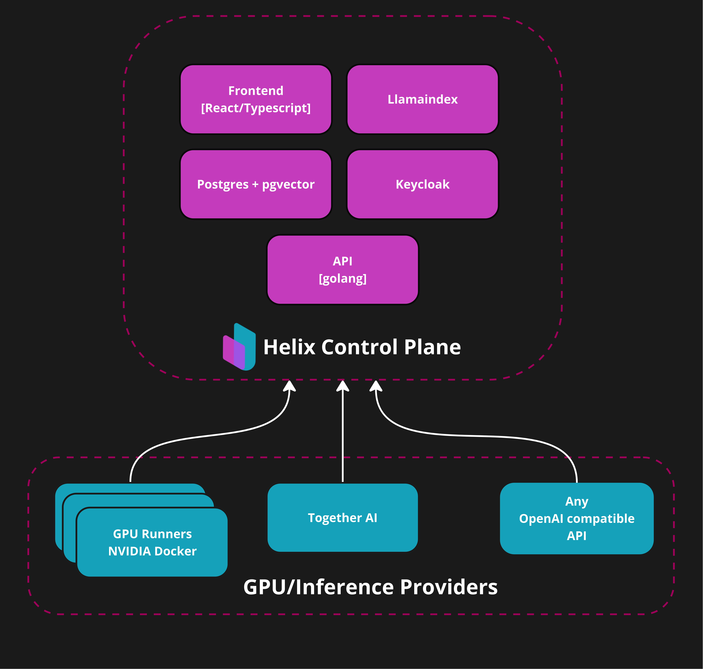

The Helix architecture is an uncomplicated stack of high quality components.

The code is available at [github.com/helixml/helix](https://github.com/helixml/helix).

## Architecture components

### Control Plane

* The [Control Plane is written in golang](https://github.com/helixml/helix/tree/main/api/pkg) and exposes an API
  * The Control Plane acts as a reverse proxy for the frontend.
  * The Control Plane communicates directly with other components.
* The frontend is [React in Typescript](https://github.com/helixml/helix/tree/main/frontend)
  * It authenticates to Keycloak
  * It connects via API and websockets to the API server
* [Keycloak](https://www.keycloak.org/) provides an authentication server
* [Postgres schema and migrations](https://github.com/helixml/helix/tree/main/api/pkg/store/migrations) are handled by the API server

See also: [docker-compose.yaml](https://github.com/helixml/helix/blob/main/docker-compose.yaml).

### Runners

[Runners](https://github.com/helixml/helix/tree/main/api/pkg/runner) connect to the control plane via API/websocket to provide GPUs running model instances. Since they only make outbound connections they can run behind NAT. Each runner knows how much GPU memory it has and polls the API server for new work to do.

A runner is a "fat" container image which contains both the runner golang service and the python virtualenvs that correspond to the [supported models](/helix/using-helix/text-inference/index.md).

It includes in the polling a set of filters which allow it to restrict jobs it accepts to ones which will fit in the amount of GPU memory it could hypothetically free if it were to stop all "stale" model instances.

Model instances are Python processes that connect to the runner's internal API and fetch the latest job to be run. They then spawn inference or fine tuning code via [ollama](https://ollama.com), [cog](https://github.com/replicate/cog) or [axolotl](https://github.com/OpenAccess-AI-Collective/axolotl).
