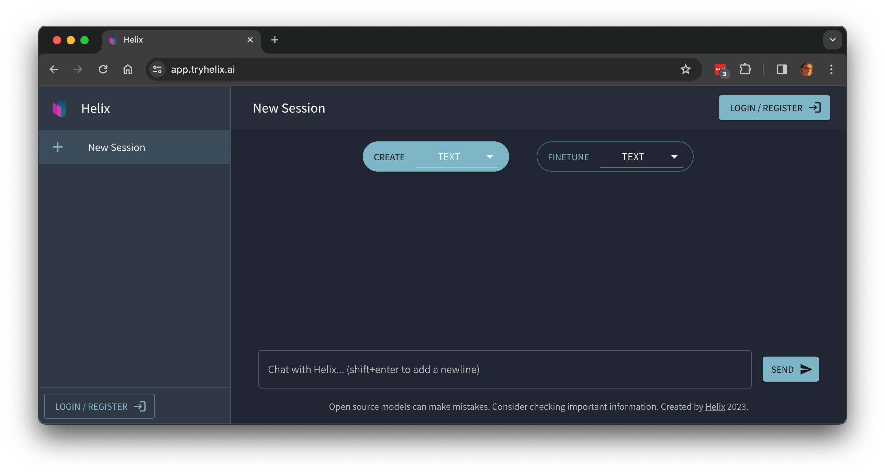
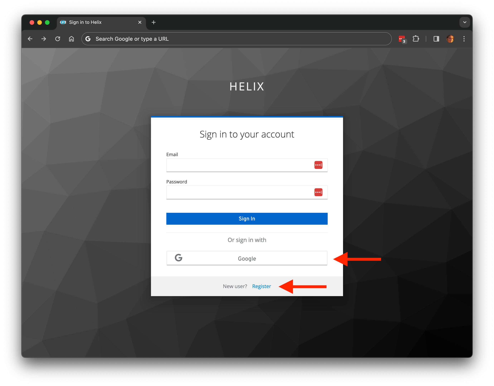
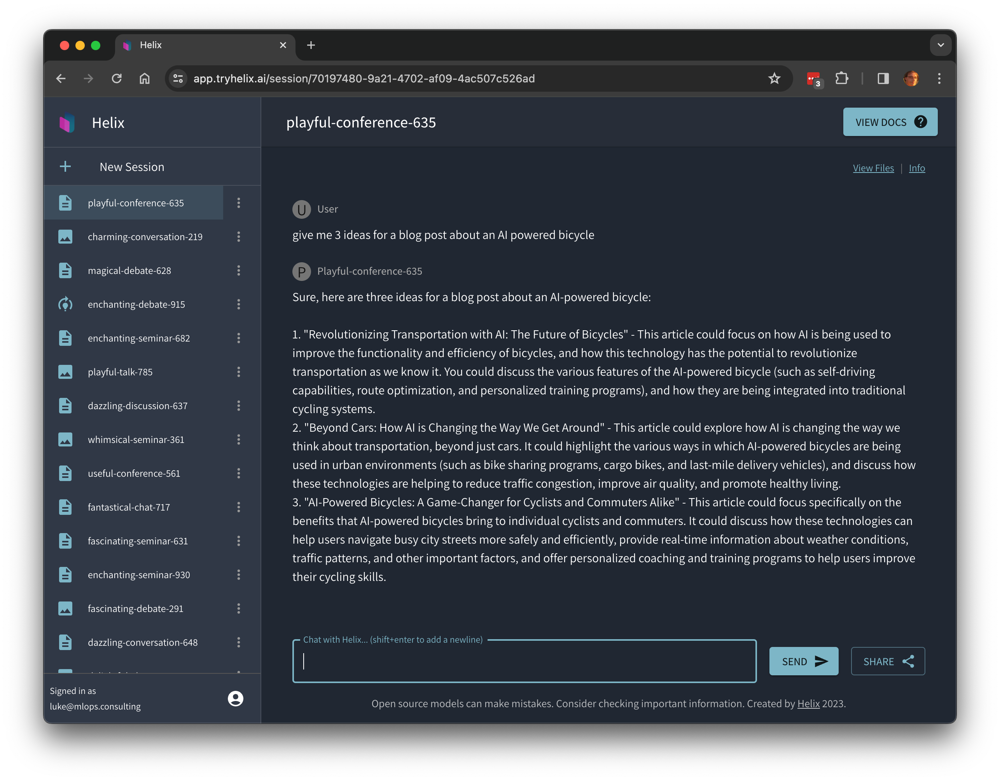
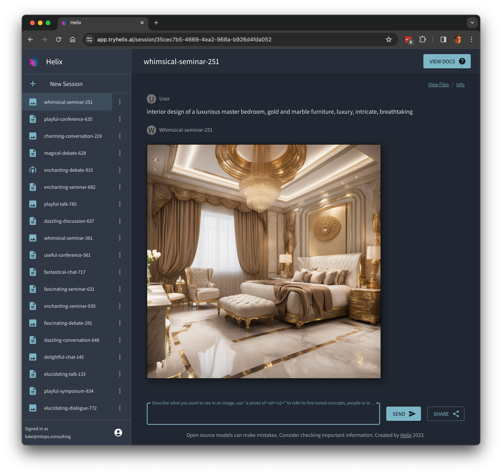

These instructions show a user how to log into [Helix Cloud](https://app.tryhelix.ai/) and use it. For deploying to your own infrastructure, see [Deploying Control Plane](/docs/controlplane).

## Log in

Go to [https://app.tryhelix.ai](https://app.tryhelix.ai)

## Sign up for an account

You can create a new username and password or log in with Google

## Try chatting to the chatbot

Ask it "give me 3 ideas for a blog post about an AI powered bicycle"

Share your results with your friends with the "Share" button!

## Try creating images

Click "New Session", then the dropdown next to "Create Text" and select "Images". Now, prompt the image model with prompts like "interior design of a luxurious master bedroom, gold and marble furniture, luxury, intricate, breathtaking"

Share your results with your friends with the "Share" button!

## Now let's fine tune a text model

1. Click "Finetune" and select "Text".
2. Now pick a recent paper from [https://arxiv.org/](https://arxiv.org/) on a subject that's interesting to you (click the "recent" link to find something the base model definitely won't know about).
3. Paste the PDF link into the "add URL" field. You can also paste in plain text or drag and drop documents (pdf, docx) into the file upload form.
4. Click next, then it will generate question-answer pairs from the document that are used to train the model. Accept the default question-answer pairs and it will train the model. This will take about 10 minutes. 
5. Come back when it's finished and then try talking to the chatbot.
6. You can now share your trained model by clicking the "share" button on the page.

## Now let's fine tune an image model

1. Click "Finetune" and select "Image".
2. Now drag and drop some images and label them, for example selfies of yourself or any object or style you want to generate an image model that can copy. You should provide at least 5 examples.
3. Use the prompt "A photo of <s0><s1>", you can add additional text after that prompt as well, but the "<s0><s1>" bit tells it to reference the concepts in the uploaded images.
4. Feel free to share your session so that others can use your fine-tuned model!

If you find yourself stuck in the queue for a long time, you can upgrade to a [paid account](https://app.tryhelix.ai/account) to jump the queue, or [deploy Helix on your own infrastructure](/docs/controlplane).