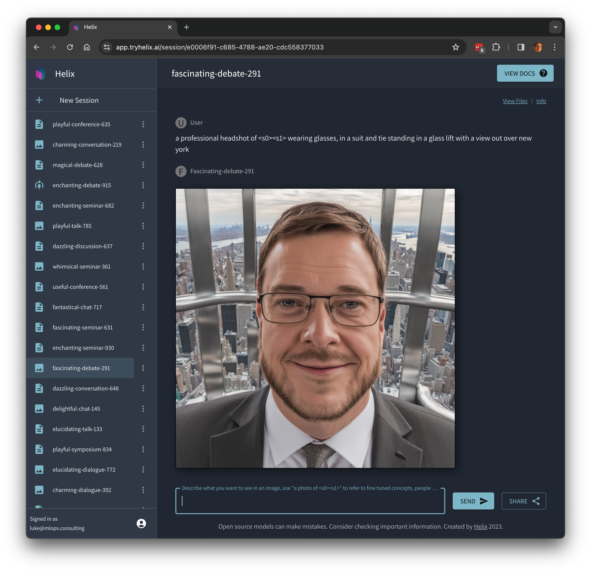

These instructions show how you can experiment with [Helix Cloud](https://app.tryhelix.ai/). If you want to deploy to your own infrastucture, see the section on [Private Deployment](/helix/private-deployment/_index.md).

## Log In

Browse to [https://app.tryhelix.ai](https://app.tryhelix.ai) and click "LOGIN / REGISTER".

## Sign up for an Account

You can create a new username and password or log in with Google.

## Chat with a Chatbot

Ask it: `give me 3 ideas for a blog post about an AI powered bicycle`.

Share your results with your friends with the "Share" button!

## Generate Images

Click "New Session", then next to the text box at the bottom click the "Text" button to switch it to "Image" mode.

Now, prompt the image model with prompts like: `interior design of a luxurious master bedroom, gold and marble furniture, luxury, intricate, breathtaking`

Share your results with your friends with the "Share" button!

## Learn New Knowledge

1. Click "New Session", slide the toggle to "Learn" and select "Text".

2. Now pick a recent paper from [https://arxiv.org/](https://arxiv.org/) on a subject that's interesting to you (click the "recent" link to find something the base model definitely won't know about).
3. Paste the PDF link into the "Links" field and click the "+" button. You can also paste in plain text or drag and drop documents (pdf, docx) into the file upload form.
4. Click "Continue" and Helix will download and ingest the content.
5. Now chat with the chat bot and ask questions about the paper.
6. Share this chat bot with your friends by clicking the "Share" button.

## Fine Tune an Image Model

1. Click "New Session", slide the toggle to "Learn" and select "Images".

2. Now drag and drop some images and label them, for example selfies of yourself or any object or style you want to generate an image model that can copy. You should provide at least 5 examples. Be sure to follow the instructions to label the photos.
3. Click "Train" and wait until it is complete. It will take a while.
4. Use the prompt "A photo of &lt;s0&gt;&lt;s1&gt;", you can add additional text after that prompt as well, but the "&lt;s0&gt;&lt;s1&gt;" bit tells it to reference the concept/object in the uploaded images.
5. Feel free to share your session so that others can use your fine-tuned model!

If you find yourself stuck in the queue for a long time, you can upgrade to a [paid account](https://app.tryhelix.ai/account) to jump the queue, or [deploy Helix on your own infrastructure](/helix/private-deployment/_index.md).
