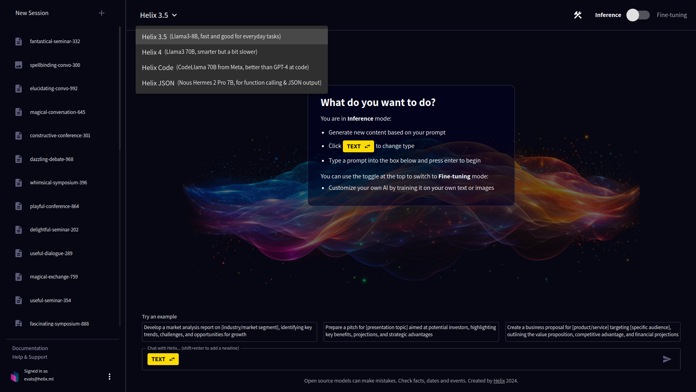

Helix offers a variety of powerful features for working with large language models and image generation models. Let's explore some of the key capabilities:

 

## Text Inference

Helix provides several large language models optimized for different use cases:

- **Helix 3.5**: Uses Llama3-8B, fast and good for everyday tasks.
- **Helix 4**: Powered by Llama3 70B, smarter but a bit slower.
- **Helix Mixtral**: Uses Mistral 8x7B MoE, we rely on this for some use cases.
- **Helix JSON**: Based on Nous-Hermes 2 Theta, for function calling & JSON output.
- **Helix Small**: Uses Phi-3 Mini 3.8B, fast and memory efficient.

### Chat to a model

Log in at [app.tryhelix.ai](https://app.tryhelix.ai).

Choose the model you would like to chat with using the dropdown in the toolbar. Let's start with Helix 3.5.

 

Now we'll hit one of the example prompts to get started. "Compose a email regarding project timeline adjustments to a client, explaining the reasons, impacts, and the revised timelines".

 

The model will generate a response based on the prompt provided. You can continue the conversation by adding more prompts or questions.

 

Share your results with your friends with the "Share" button or on our [Discord](https://discord.gg/VJftd844GE)!

 

## Image Inference 

Helix uses the [Stable Diffusion XL](https://stability.ai/stable-diffusion) image diffusion models to provide high quality images with relatively small memory GPU footprint, including fine-tuning teach the model new people, styles or concepts to represent visually.

## Try creating images

Click "New Session", then the dropdown next to "Create Text" and select "Images". Now, prompt the image model with prompts like "interior design of a luxurious master bedroom, gold and marble furniture, luxury, intricate, breathtaking"

 

Good prompts to try for SDXL (Stable Diffusion XL)

- macro close-up shot of the eyes of a caterpillar
- Cute rabbit wearing a jacket, eating a carrot, 3D Style, rendering
- a cute happy cat, pixel art, pixelated
- (fractal crystal skin:1.1) with( ice crown:1.4) woman, white crystal skin, (fantasy:1.3), (Anna Dittmann:1.3)
- isometric view, isometric style, outdoors, sky, night, moon, neon, building, star (sky), night sky, scenery, city, sign, wide shot, crescent moon, neon lights
- beautiful silhouette shot of a ballerina dancer
- a glowing jellyfish underwater, breathtaking
- photo of a rhino dressed suit and tie sitting at a table in a bar with a bar stools, award winning photography, Elke vogelsang
- b&w photography, model shot, man in subway station, beautiful detailed eyes, professional award winning portrait photography, Zeiss 150mm f/2.8, highly detailed glossy eyes, high detailed skin, skin pores
- a painting of a woman with a butterfly on a yellow wall, graffiti art, inspired by Brad Kunkle, tutu, russ mills, hip skirt wings, andrey gordeev
- a painting of a fish on a black background, a digital painting, by Jason Benjamin, shutterstock, colorful vector illustration, mixed media style illustration, epic full color illustration, mascot illustration
- a painting of a beautiful graceful woman with long hair, a fine art painting, by Qiu Ying, no gradients, flowing sakura silk, beautiful oil painting
- analog film photo of old woman on the streets of london . faded film, desaturated, 35mm photo, grainy, vignette, vintage, Kodachrome, Lomography, stained, highly detailed, found footage
- vaporwave synthwave style Los Angeles street. cyberpunk, neon, vibes, stunningly beautiful, crisp, detailed, sleek, ultramodern, high contrast, cinematic composition
- 16-bit pixel art, a cozy cafe side view, a beautiful day
- claymation style captain jack sparrow on tropical island. sculpture, clay art, centered composition, play-doh

 

## Text Fine-Tuning

 

Helix uses the [Mistral](https://mistral.ai/) series of large language models to provide high quality responses with relatively small memory GPU footprint, including fine-tuning teach the model new information or styles of reasoning and presenting information.

### Preparing the model to Learn

1. Click "Learn" and select "Text".
2. Now choose your data source. For example, you can pick a recent paper from [https://arxiv.org/](https://arxiv.org/) on a subject that's interesting to you (click the "recent" link to find something the base model definitely won't know about).
3. For example, paste a PDF link into the "add URL" field. You can also paste in plain text or drag and drop documents (pdf, docx) into the file upload form.
4. Click next, then it will generate question-answer pairs from the document that are used to train the model. Accept the default question-answer pairs and it will train the model. This will take about 10 minutes. 
5. Come back when it's finished and then try talking to the chatbot.

 

## Image Fine-Tuning

 

1. Click "Learn" and select "Image".
2. Now drag and drop some images and label them, for example selfies of yourself or any object or style you want to generate an image model that can copy. You should provide at least 5 examples.
3. Use the prompt "A photo of &lt;s0&gt;&lt;s1&gt;", you can add additional text after that prompt as well, but the "<s0><s1>" bit tells it to reference the concepts in the uploaded images.

Share your results with your friends with the "Share" button or on our [Discord](https://discord.gg/VJftd844GE)!

If you find yourself stuck in the queue for a long time, you can upgrade to a [paid account](https://app.tryhelix.ai/account) to jump the queue, or [deploy Helix on your own infrastructure](/docs/controlplane).

