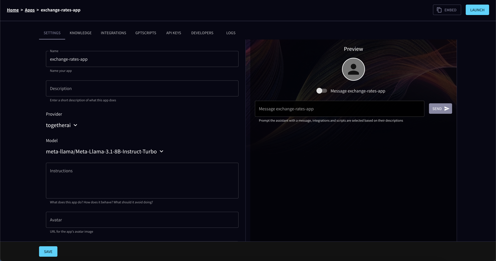
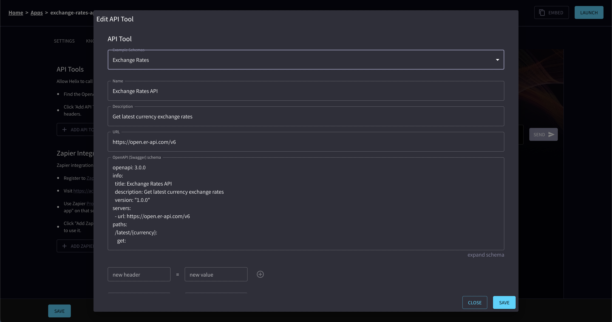

# Helix MCP

A Model Context Protocol (MCP) server implementation that integrates with Helix for API tools, GPTScripts, and more.

With [API tools](/helix/develop/apps/#api-integrations) you can make any HTTP API available as an MCP server.

## Install Helix CLI

Helix CLI can run as an MCP proxy server that will forward requests to the Helix API. To install it, run:

```bash
curl -Ls -O https://get.helix.ml/install.sh && bash install.sh --cli
```

Then, visit your Helix instance's [account page](https://app.tryhelix.ai/account) and copy the API key.

## Create a Helix app

Let's create a new Helix app which will expose exchange rates:



Then, click on the Integrations tab and select "Exchange Rates" example. This will load the OpenAPI spec for the Exchange Rates API.




## Claude Desktop

```json
{
  "mcpServers": {
    "helix": {
      "command": "/usr/local/bin/helix",
      "args": [
        "mcp",
        "run"
      ],
      "env": {
        "HELIX_API_KEY": "YOUR PERSONAL API KEY (https://app.tryhelix.ai/account)",
        "HELIX_URL": "https://app.tryhelix.ai",
        "HELIX_APP_ID": "YOUR APP ID"
      }
    }   
  }
}
```