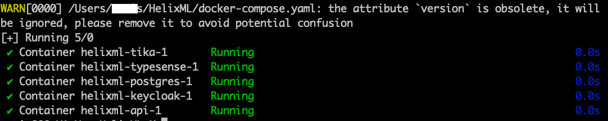
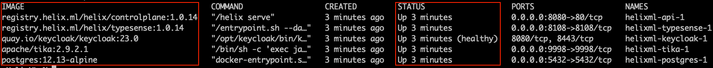
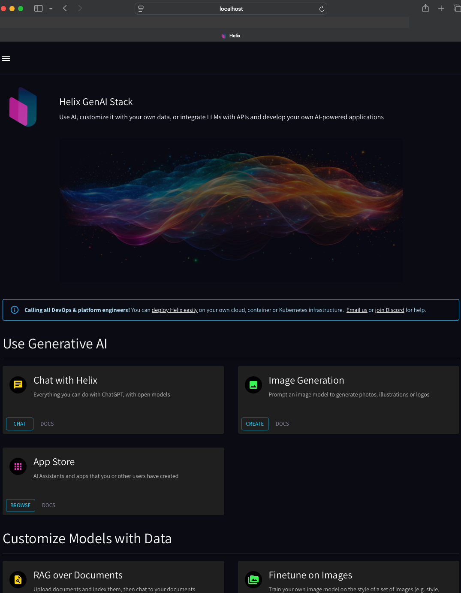
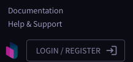
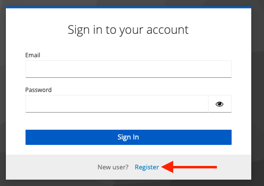
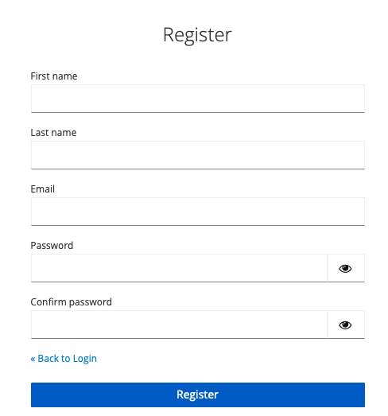
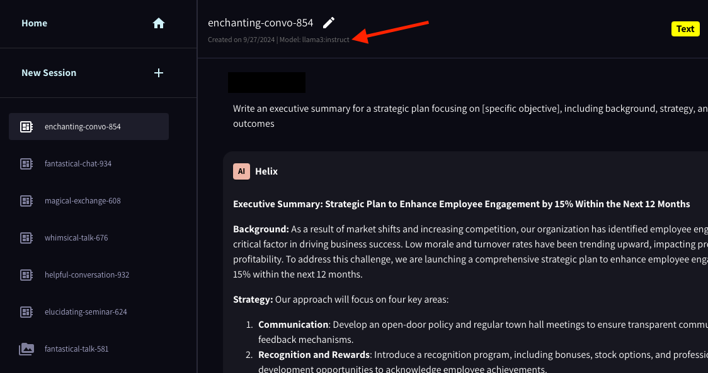

## Requirements

### Docker

1. Install Docker Desktop by visiting the [installer page](https://docs.docker.com/desktop/install/mac-install/) and if this is your first time installing Docker Desktop, you may want to restart your computer after installation. Otherwise, Helix may not be able to find it in the later steps below.

### Ollama

1. Install Ollama by visiting the [installer page](https://ollama.com/download/mac)
2. Download Ollama Model (note - from here you need to open the terminal)
```shell
ollama pull llama3:instruct
```
1. Confirm that the model exists - values proceeding name of the model may differ
```shell
ollama ls | grep "llama3:instruct"
```
> You should get a confirmation similar to this:
```shell
llama3:instruct               365c0bd3c000    4.7 GB    43 hours ago
```

## Install Helix
### Run installation script
```shell
curl -sL -O https://get.helixml.tech/install.sh && bash install.sh
```


### Successful completion of the installation


### Spin up Helix Docker Instances
1. Change directory to location of HelixML payload is downloaded
```shell
cd ~/HelixML
```
2. Launch Docker Desktop on your computer
3. Launch Docker Containers
```shell
docker compose up -d --remove-orphans
```

3. Confirm that all container are running and show a healthy status


## Login to Helix UI
1. In a web browser go to: http://localhost:8080/

2. Register local user
   1. Bottom left pane - click on “Login/Register”

   2. Click on "Register" to begin the user registeration process

   3. Complete user registration

2. To access the app, log in to the local HelixML UI with your registered user credentials

