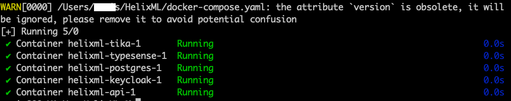
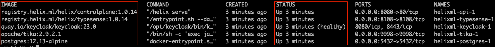
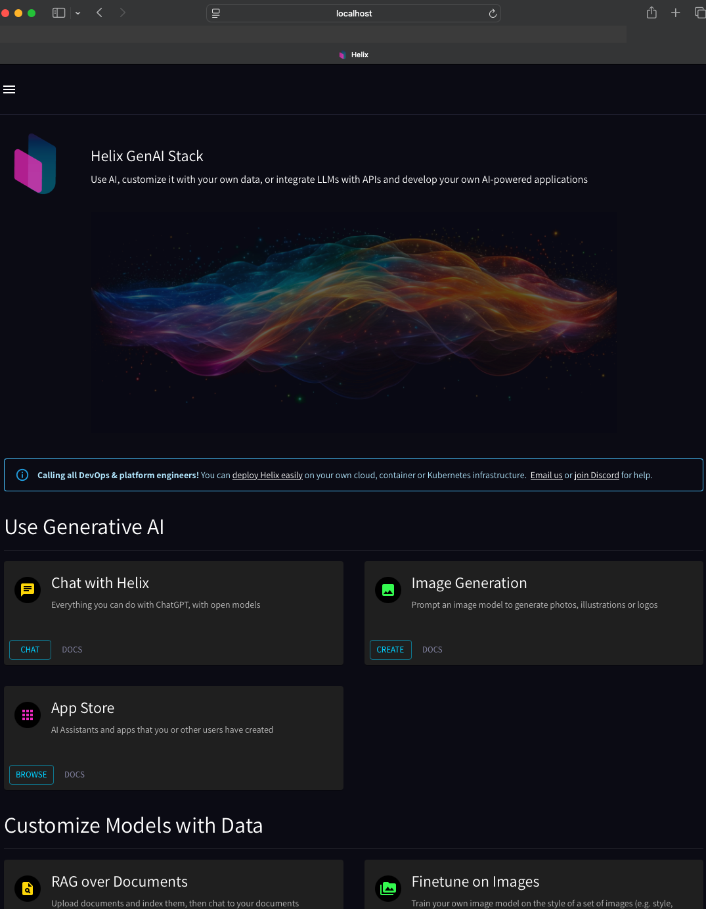
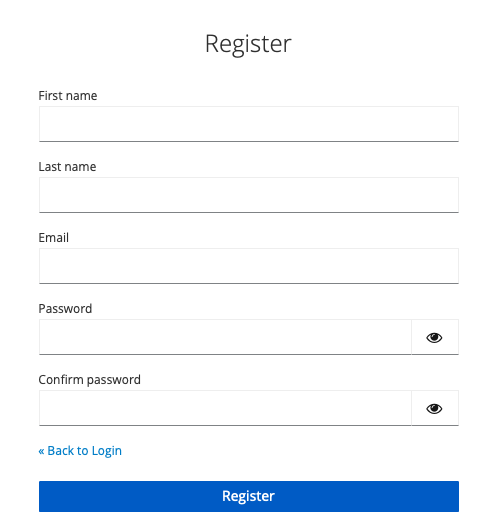
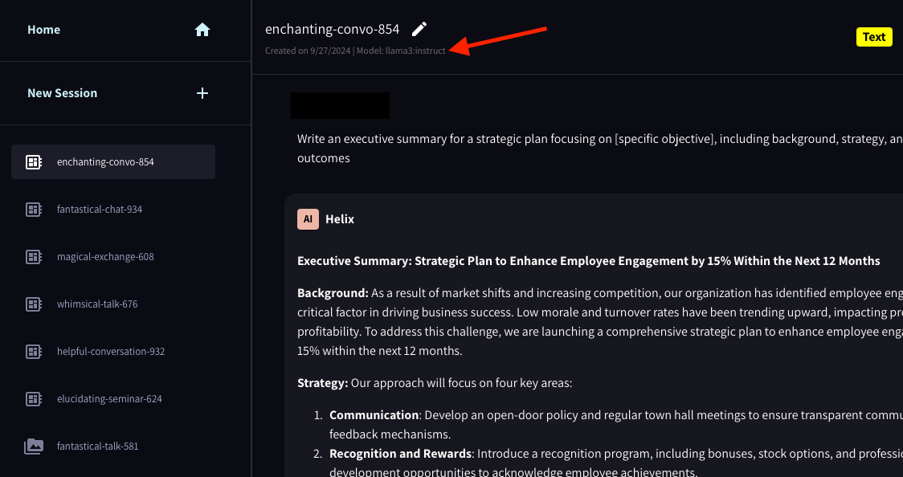

## Requirements
**_Created on Windows (WSL2)_**
1. Following instructions assume that you have WSL installed
   1. Open PowerShell or Windows Command Prompt in administrator mode by right-clicking and selecting Run as administrator
```shell
wsl --install
```

2. Install Docker Desktop
    [Install Docker](https://docs.docker.com/desktop/install/windows-install/)
NOTE: [Make sure that you're signed on to your Docker account](https://docs.docker.com/desktop/get-started/)

1. Install Ollama 
    [Install Ollama](https://ollama.com/download/windows)

2. Download Ollama Model
```shell
ollama pull llama3:instruct
```
1. Confirm that the model exists - values proceeding name of the model may differ
```shell
ollama ls | grep "llama3:instruct"
```
> You should get a confirmation similar to this:
```shell
llama3:instruct               365c0bd3c000    4.7 GB    43 hours ago
```

## Install Helix
### Run installation script
```shell
curl -sL -O https://get.helix.ml/install.sh && bash install.sh
```

### Successful completion of the installation

### Spin up Helix Docker Instances
1. Change directory to location of HelixML payload is downloaded
```shell
cd /Users/"<yourLocalUser>"/HelixML
```
2. Launch Docker Desktop on your computer
3. Launch Docker Containers
```shell
docker compose up -d --remove-orphans
```

3. Confirm that all container are running and show a healthy status


## Login to Helix UI
1. In a web browser go to: http://localhost:8080/

2. Register local user
   1. Bottom left pane - click on “Login/Register”

   2. Click on "Register" to begin the user registeration process

   3. Complete user registration

2. To access the app, log in to the local HelixML UI with your registered user credentials


