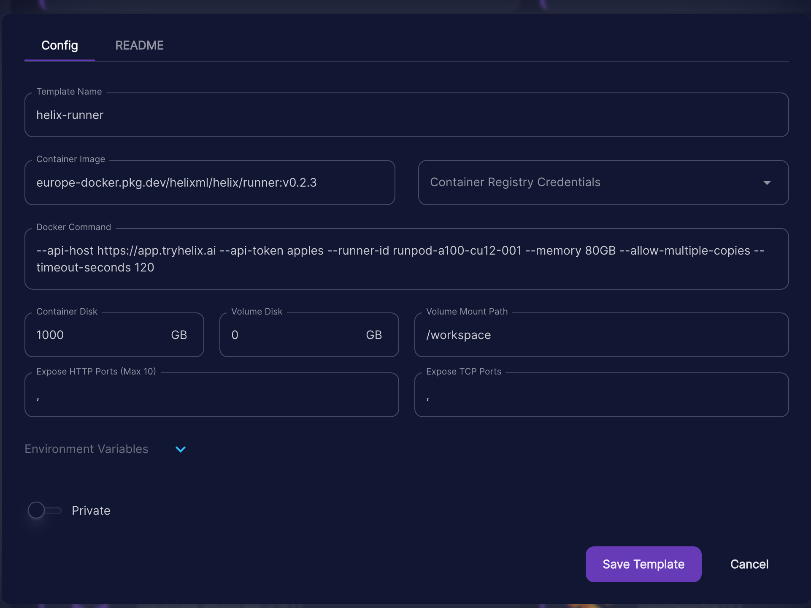

Create a runpod GPU pod template like this:



**Don't use the version or arguments in the screenshot above, use the details below**

Container image:
```
registry.helix.ml/helix/runner:<LATEST_TAG>
```

Where `<LATEST_TAG>` is the tag of the latest release in the form `X.Y.Z` from [https://get.helix.ml/latest.txt](https://get.helix.ml/latest.txt)

You can also use `X.Y.Z-small` to use an image with Llama3-8B and Phi3-Mini pre-baked (`llama3:instruct,phi3:instruct`), or `X.Y.Z-large` for one with [all our supported Ollama models](https://docs.helix.ml/helix/models/models/) pre-baked. Warning: the `large` image is large (over 100GB), but it saves you re-downloading the weights every time the container restarts! We recommend using `X.Y.Z-small` and setting the `RUNTIME_OLLAMA_WARMUP_MODELS` environment variable to `llama3:instruct,phi3:instruct` to get started (in the runpod UI), so the download isn't too big. If you want to use other models in the interface, don't specify `RUNTIME_OLLAMA_WARMUP_MODELS` environment variable, and it will use the defaults (all models).

Docker Command:
```
--api-host https://<YOUR_CONTROLPLANE_HOSTNAME> --api-token <RUNNER_TOKEN_FROM_ENV> --runner-id runpod-001 --memory <GPU_MEMORY>GB --allow-multiple-copies
```

Replace `<RUNNER_TOKEN_FROM_ENV>` and `<GPU_MEMORY>` (e.g. `24GB`) accordingly. You might want to update the `runner-id` with a more descriptive name, and make sure it's unique. That ID will show up in the helix dashboard at `https://<YOUR_CONTROLPLANE_HOSTNAME>/dashboard` for admin users.

Then start runners from your template, customizing the docker command accordingly.

## Configuring a Runner


