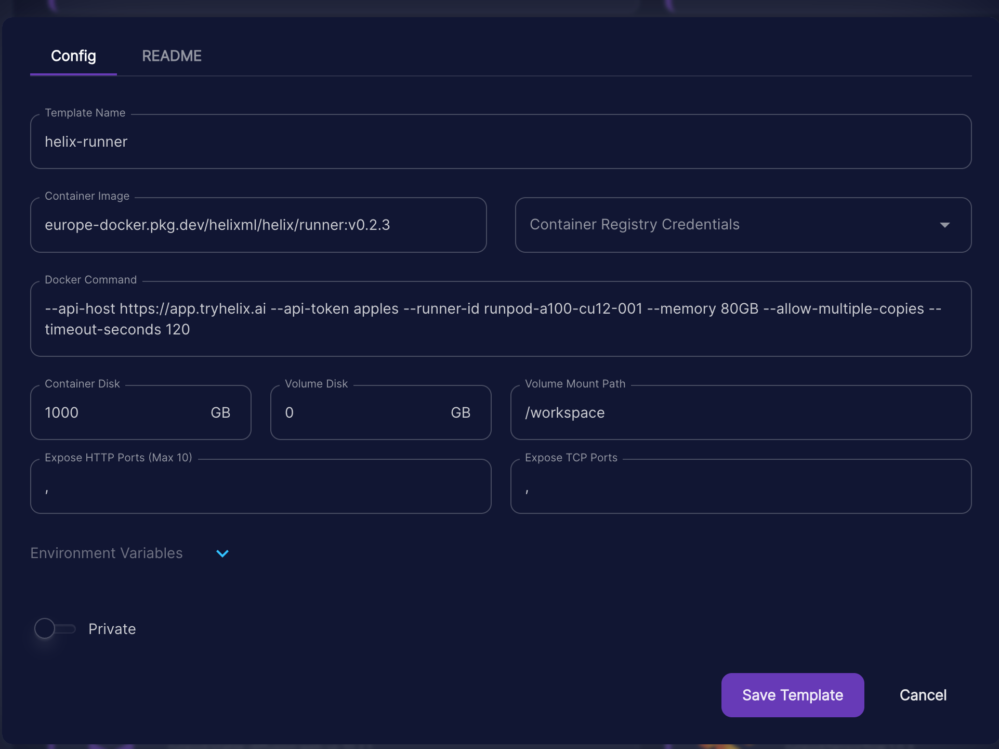

Create a runpod pod thusly:



Container image:
```
europe-docker.pkg.dev/helixml/helix/runner:v0.5.5
```

Docker Command:
```
--api-host https://app.tryhelix.ai --api-token <RUNNER_TOKEN_FROM_ENV> --runner-id runpod-a100-cu12-001 --memory 80GB --allow-multiple-copies --timeout-seconds 120
```
