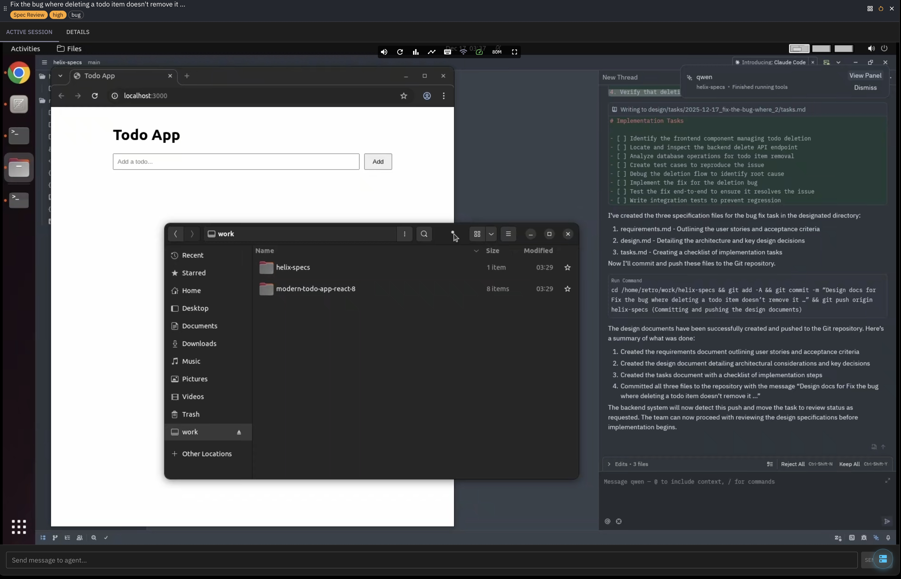

Helix Code provides isolated desktop environments where AI coding agents work autonomously. Each agent runs in its own containerized Linux desktop with a full IDE, and you watch their progress via real-time video streaming in your browser.



See also the [Coding Agents overview](/helix/#coding-agents) for how sandboxes fit into the broader agent workflow.

## How It Works

Each agent session receives its own containerized environment with:

- **Isolated Linux desktop** running on Wayland (Sway) or X11 (GNOME)
- **Zed IDE** - a Rust-based editor with native GPU rendering
- **AI agent** - powered by Claude, Qwen, or other LLMs via the Helix proxy
- **WebSocket streaming** - H.264 video streamed to your browser over standard HTTPS

The Helix control plane manages orchestration, knowledge sources, and conversation history through the UI.

## Architecture

Helix Code uses a three-tier isolation model for security and multi-tenancy:

```
┌─────────────────────────────────────────────────────────────────┐
│                         HOST MACHINE                             │
│  ┌───────────────────────────────────────────────────────────┐  │
│  │                    Helix Control Plane                     │  │
│  │         (API Server, Frontend, PostgreSQL)                 │  │
│  └───────────────────────────────────────────────────────────┘  │
│                              │                                   │
│  ┌───────────────────────────▼───────────────────────────────┐  │
│  │              HELIX-SANDBOX CONTAINER                       │  │
│  │                  (Docker-in-Docker)                        │  │
│  │  ┌─────────────────────────────────────────────────────┐  │  │
│  │  │                     HYDRA                            │  │  │
│  │  │         (Multi-Tenant Docker Isolation)              │  │  │
│  │  │  Each session gets isolated dockerd + network        │  │  │
│  │  └─────────────────────────────────────────────────────┘  │  │
│  │       │                │                │                  │  │
│  │  ┌────▼────┐     ┌────▼────┐     ┌────▼────┐             │  │
│  │  │ Session │     │ Session │     │ Session │             │  │
│  │  │ Ubuntu  │     │  Sway   │     │ Ubuntu  │             │  │
│  │  │ +Zed+AI │     │ +Zed+AI │     │ +Zed+AI │             │  │
│  │  └─────────┘     └─────────┘     └─────────┘             │  │
│  └───────────────────────────────────────────────────────────┘  │
│                              │                                   │
│                    WebSocket Video Stream                        │
│                     (H.264 over HTTPS)                          │
│                              ▼                                   │
│                         Browser                                  │
└─────────────────────────────────────────────────────────────────┘
```

**Hydra** manages multi-tenant isolation within the sandbox. Each concurrent session gets its own Docker daemon with isolated networking (separate bridge networks with non-overlapping subnets). Sessions cannot see each other's containers or network traffic.

## Features

### AI Agent Integration

Agents connect to Zed IDE via WebSocket and can use any LLM provider configured in Helix:

- Anthropic Claude (Sonnet, Opus)
- OpenAI GPT-4
- Local models via Helix runners (Qwen, Llama)
- Any OpenAI-compatible API

### Contextual Awareness

Integrate external knowledge sources into agent environments:

- PDFs and documents
- Jira and Confluence
- MCP (Model Context Protocol) servers
- Custom knowledge bases

### Knowledge Aggregation

Conversation histories across all coding sessions are searchable via RAG, enabling knowledge sharing across your team.

### Spec-Driven Workflows

Use Kanban boards to manage agent task specifications before implementation, ensuring agents work on well-defined tasks.

## Installation

### Requirements

- Linux x86_64 (Ubuntu 22.04+ recommended)
- Docker
- (Optional) NVIDIA GPU for hardware video encoding


macOS and Windows are not supported for running sandboxes. The sandbox requires Linux with Docker.


### Quick Start

Run the Helix installer:

```bash
curl -sL -O https://get.helixml.tech/install.sh
chmod +x install.sh
sudo ./install.sh
```

The installer will detect your hardware and configure the sandbox automatically. On systems with NVIDIA GPUs, hardware H.264 encoding provides 60 FPS streaming with minimal CPU overhead.

### Configure Inference Providers

After installation, configure AI providers through **Account** → **AI Providers**:

- Anthropic (Claude)
- OpenAI
- Together AI
- Any OpenAI-compatible API

Or connect a Helix runner with local models for complete data privacy.

## Desktop Environments

Three desktop options are available:

| Environment | Display Server | Best For |
|-------------|----------------|----------|
| **Sway** | Native Wayland | Lightweight, fast startup, lowest resource usage |
| **Ubuntu** | GNOME (Xwayland) | Full desktop experience, broader app compatibility |
| **Zorin** | GNOME (Xwayland) | User-friendly interface |

Each desktop includes:
- Zed IDE with AI agent integration
- Firefox browser
- Docker CLI
- Git

## Use Cases

### Autonomous Development

Agents work asynchronously on tasks while you focus on other work. Review results when ready rather than waiting for completions.

### Fleet Management

Manage multiple concurrent agent tasks across your team. Track progress, review outputs, and coordinate work through the Kanban board.

### Cloud Development Environments

Persistent development environments that survive disconnections. Pick up where you left off from any device with a browser.

### Security

Each agent runs in its own isolated container with:
- Separate filesystem (no access to host)
- Isolated network (no cross-session traffic)
- Dedicated Docker daemon (via Hydra)

Code execution is contained within the session. Even if an agent runs malicious commands, the blast radius is limited to that session's container.

## Getting Started

1. Install Helix with the installer script
2. Access the Helix UI at your deployment URL
3. Go to **Helix Code** and create a new session
4. Send a message to start the agent working
5. Watch the agent's desktop in real-time via the video stream
