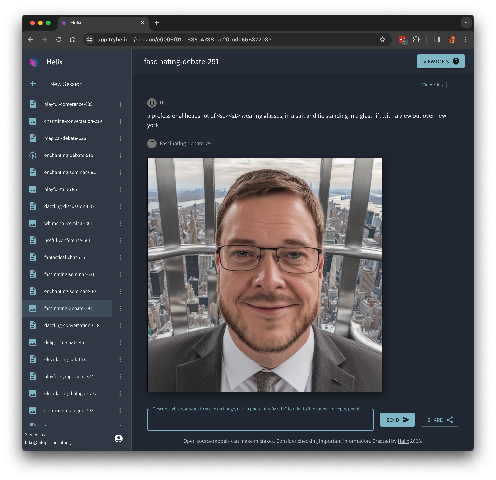

Helix uses the [Mistral](https://mistral.ai/) series of large language models to provide high quality responses with relatively small memory GPU footprint, including fine-tuning teach the model new information or styles of reasoning and presenting information.

## Now let's fine tune an image model

1. Click "Finetune" and select "Image".
2. Now drag and drop some images and label them, for example selfies of yourself or any object or style you want to generate an image model that can copy. You should provide at least 5 examples.
3. Use the prompt "A photo of &lt;s0&gt;&lt;s1&gt;", you can add additional text after that prompt as well, but the "&lt;s0&gt;&lt;s1&gt;" bit tells it to reference the object/concept in the uploaded images.

Share your results with your friends with the "Share" button or on our [Discord](https://discord.gg/VJftd844GE)!

If you find yourself stuck in the queue for a long time, you can upgrade to a [paid account](https://app.tryhelix.ai/account) to jump the queue, or [deploy Helix on your own infrastructure](/docs/controlplane).
