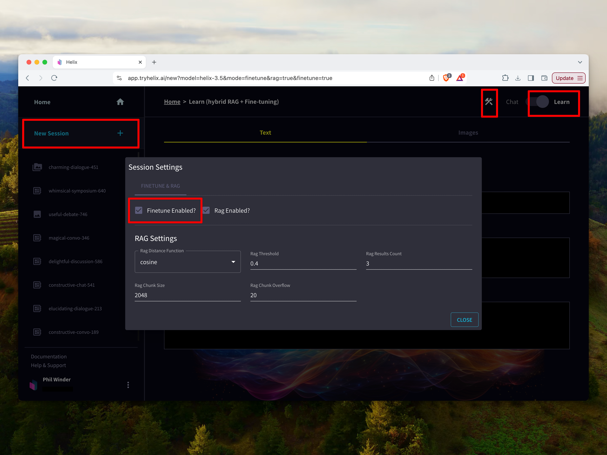
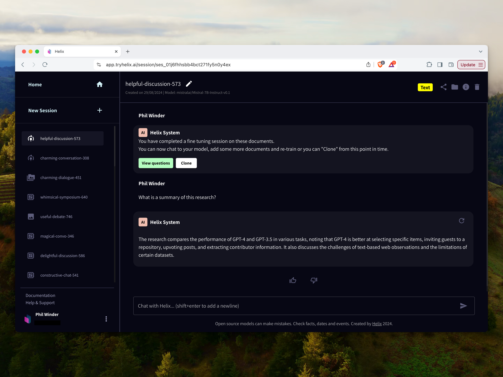

Helix uses the [Mistral](https://mistral.ai/) series of large language models for fine-tuning.

## How to Fine-Tune a Language Model on a Document

1. Click "New Session", "Learn", click on the settings, and click "Finetune Enabled":

2. Now pick a recent paper from [https://arxiv.org/](https://arxiv.org/) on a subject that's interesting to you (click the "recent" link to find something the base model definitely won't know about).
3. Paste the PDF link into the "Links" field and click the "+" button. You can also paste in plain text or drag and drop documents (pdf, docx) into the file upload form.
4. Click "Continue" and Helix will download and ingest the content.
5. Now chat with the chat bot and ask questions about the paper.
6. Share this chat bot with your friends by clicking the "Share" button.

If you find yourself stuck in the queue for a long time, you can upgrade to a [paid account](https://app.tryhelix.ai/account) to jump the queue, or [deploy Helix on your own infrastructure](/helix/private-deployment/_index.md).

## How Fine-Tuning Works

The first step in fine-tuning is generation of the training data. If you pass question-answer pairs, it will use these to fine-tune the model.

If you pass text, a document, or a link, Helix will run a series of steps to automatically generate question-answer (QA) pairs on your behalf. You can view these pairs once QA generation is complete.

In the next step, Helix uses low-rank adaptors (LORA) to customise the behaviour of a large language model. These are small, simple custom models that mutate the internal computation of the language model. These changes cause the model to produce outputs that are similar to the QA pairs.
