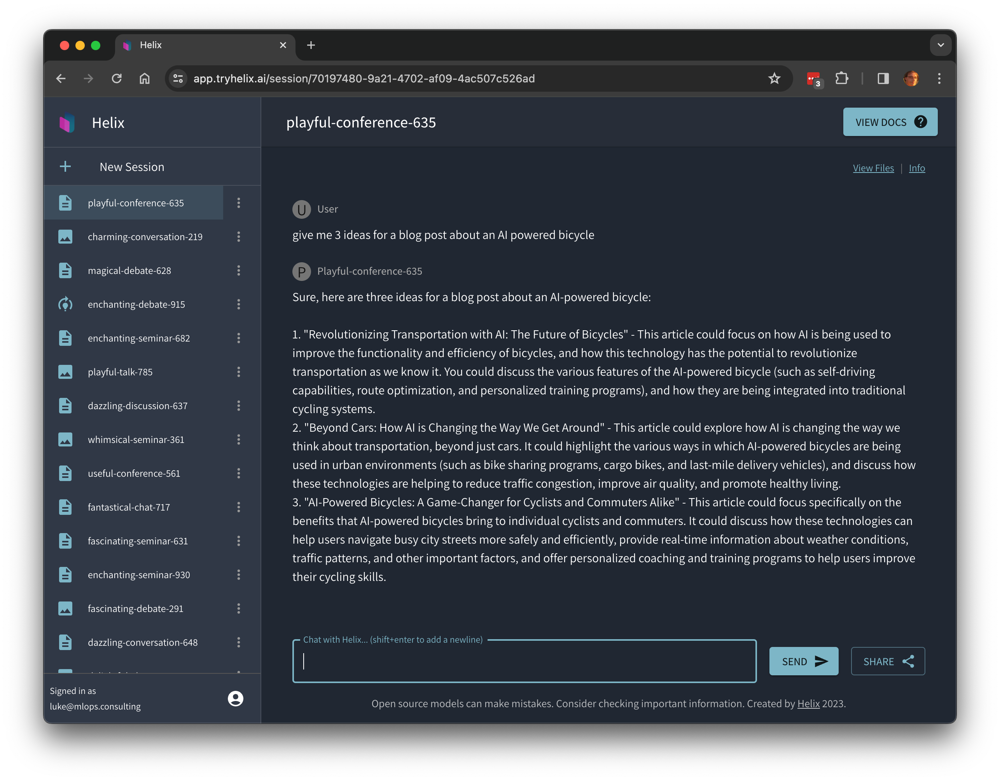

Helix uses the [Mistral](https://mistral.ai/) series of large language models to provide high quality responses with relatively small memory GPU footprint, including fine-tuning teach the model new information or styles of reasoning and presenting information.

## Try chatting to the chatbot

Log in at [app.tryhelix.ai](https://app.tryhelix.ai).

Ask it "give me 3 ideas for a blog post about an AI powered bicycle".

Share your results with your friends with the "Share" button or on our [Discord](https://discord.gg/VJftd844GE)!

If you find yourself stuck in the queue for a long time, you can upgrade to a [paid account](https://app.tryhelix.ai/account) to jump the queue, or [deploy Helix on your own infrastructure](/docs/controlplane).