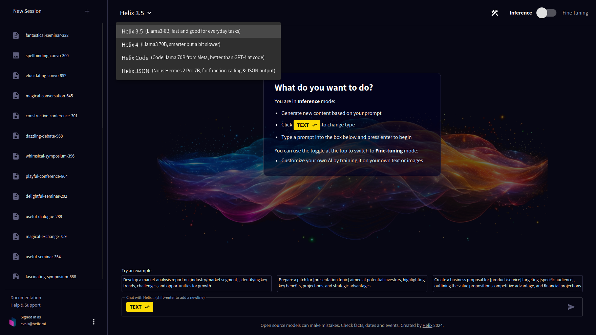
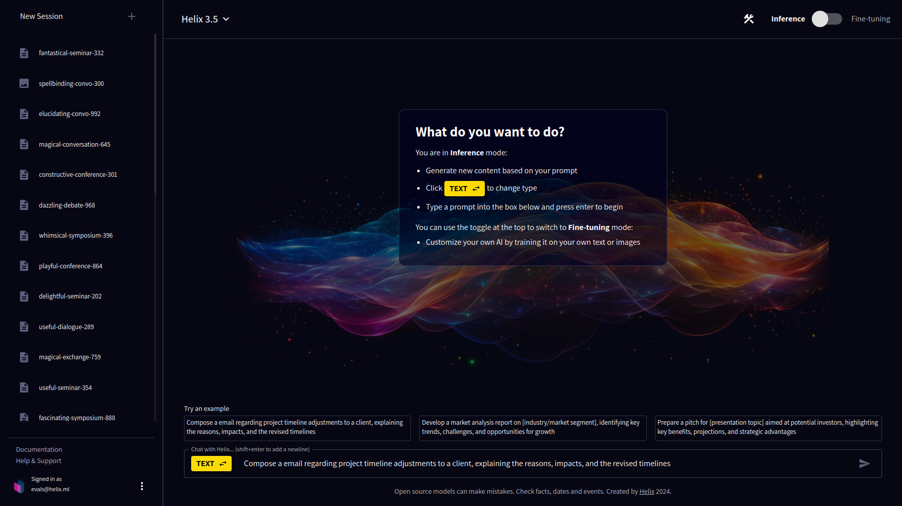
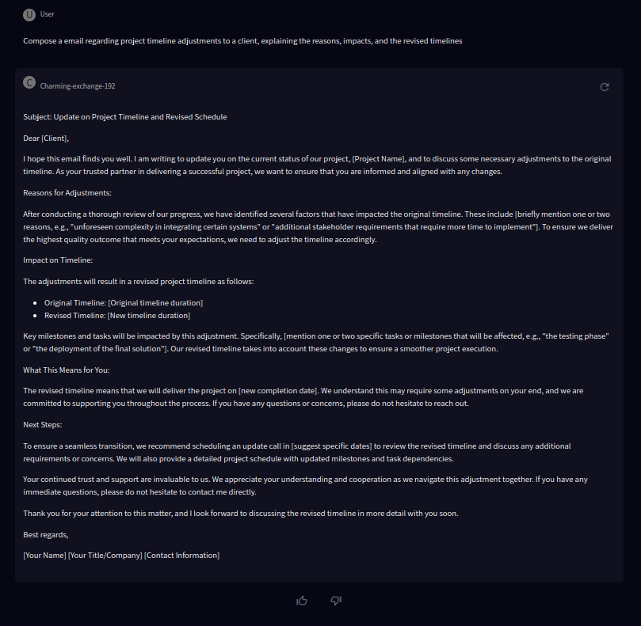
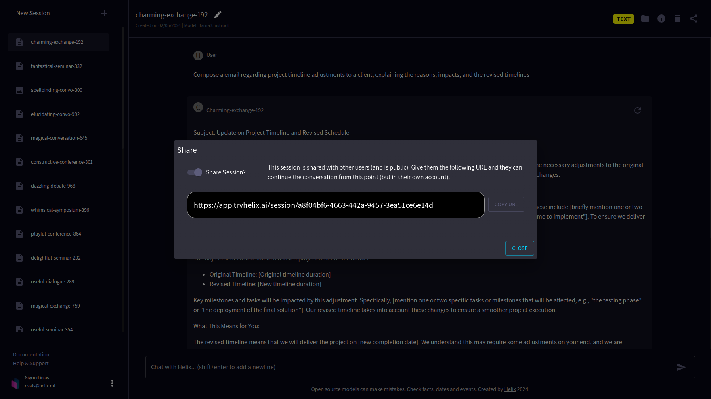

Helix offers a variety of large language models tailored for different needs, all designed to provide high-quality responses with a relatively small GPU memory footprint. These include:

- **Helix 3.5**: Utilizes Llama3-8B for fast and efficient performance, ideal for everyday tasks. Ollama tag `llama3:instruct`.
- **Helix 4**: Powered by Llama3-70B, this model offers deeper insights and although a bit slower, it's smarter for complex queries. Ollama tag `llama3:70b`.
- **Helix Mixtral**: Features Mistral's mixture of experts, that outperforms OpenAI at many tasks. Ollama tag `mixtral:instruct`.
- **Helix JSON**: Operates on Nous Hermes 2 Pro 7B, specialized for function calling and generating JSON outputs, enhancing automation and integration tasks. Ollama tag `adrienbrault/nous-hermes2theta-llama3-8b:q8_0`.
- **Helix Small**: A smaller model based on Phi-3 Mini 3.8B, fast and memory efficent. Ollama tag `phi3:instruct`.

## Try chatting to the chatbot

Log in at [app.tryhelix.ai](https://app.tryhelix.ai).

Choose the model you would like to chat with using the dropdown in the toolbar. Let's start with Helix 3.5.

Now we'll hit one of the example prompts to get started. "Compose a email regarding project timeline adjustments to a client, explaining the reasons, impacts, and the revised timelines".

The model will generate a response based on the prompt provided. You can continue the conversation by adding more prompts or questions.

Share your results with your friends with the "Share" button or on our [Discord](https://discord.gg/VJftd844GE)!

If you find yourself stuck in the queue for a long time, you can upgrade to a [paid account](https://app.tryhelix.ai/account) to jump the queue, or [deploy Helix on your own infrastructure](/docs/controlplane).

## Inference Best Practices

* Imagine yourself performing the task or answering the question
* If you need to ask questions, then you haven't provided enough context
* If you are asking questions about a thing, indicate what the thing is
