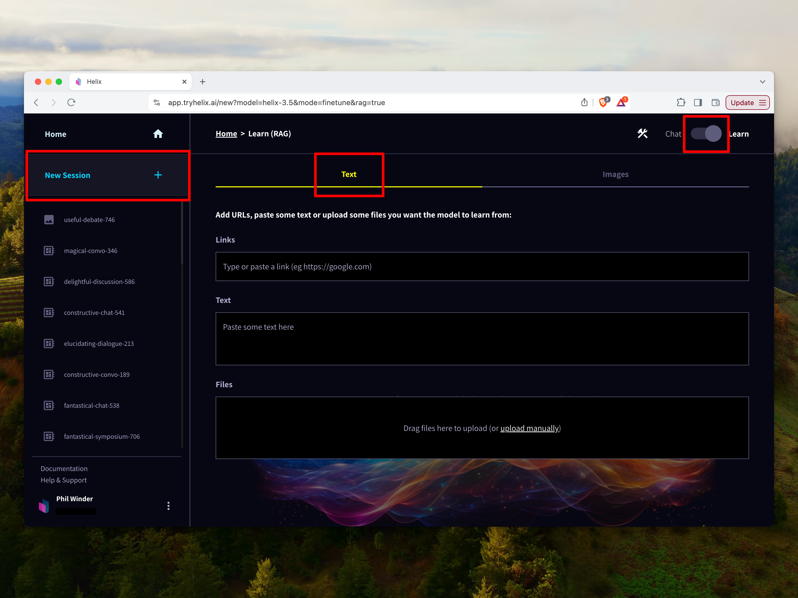
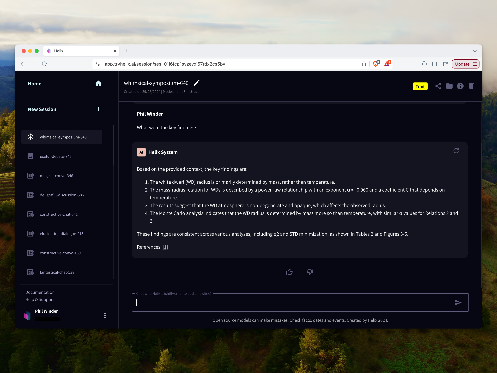
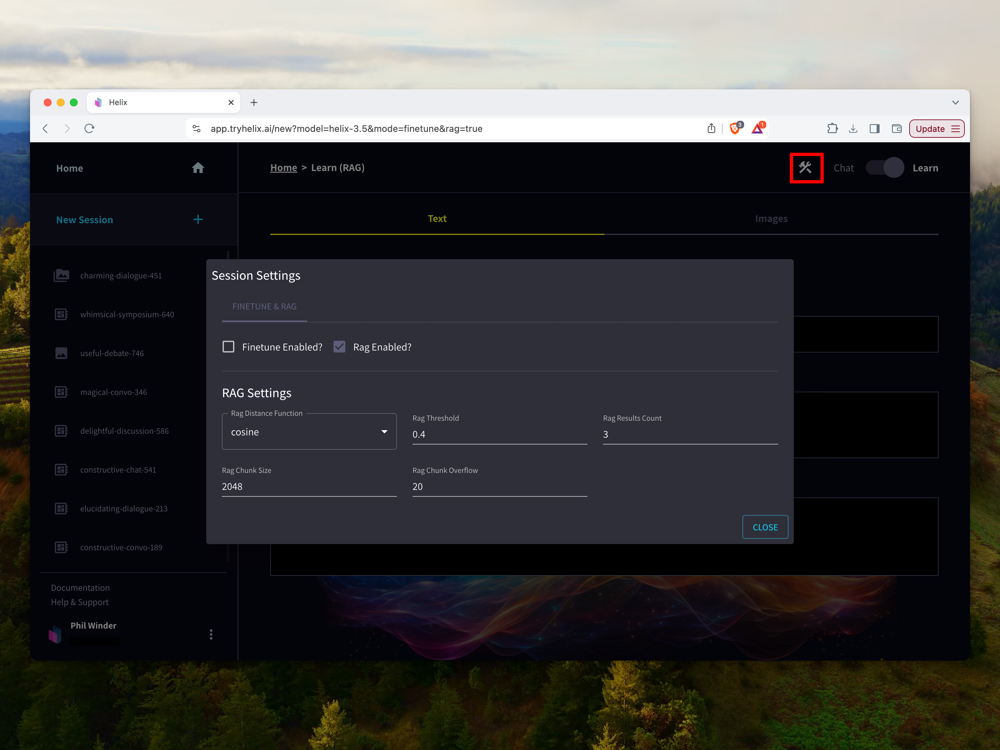

The default "Learn" mode for text is to use retrieval augmented generation (RAG). This method ingests data into a database for quick retrieval. At inference time, the language model includes relevant information in the context.

## RAG Tutorial

1. Click "New Session", slide the toggle to "Learn" and select "Text".

2. Now pick a recent paper from [https://arxiv.org/](https://arxiv.org/) on a subject that's interesting to you (click the "recent" link to find something the base model definitely won't know about).
3. Paste the PDF link into the "Links" field and click the "+" button. You can also paste in plain text or drag and drop documents (pdf, docx) into the file upload form.
4. Click "Continue" and Helix will download and ingest the content.
5. Now chat with the chat bot and ask questions about the paper.
6. Share this chat bot with your friends by clicking the "Share" button.

## Configuring RAG

To configure the RAG settings used by Helix, click the hammer and spanner icon at the top right.

You can configure the following settings:

- **Rag Distance Function**: the distance metric used for measuring similarity.
- **Rag Threshold**: the relevancy threshold. This requires tuning for your specific use case.
- **Rag Results Count**: how many results are used in the language model context.
- **Rag Chunk Size**: the number of characters included in each chunk.
- **Rag Chunk Overlap**: the number of characters that each chunk overlaps by.
