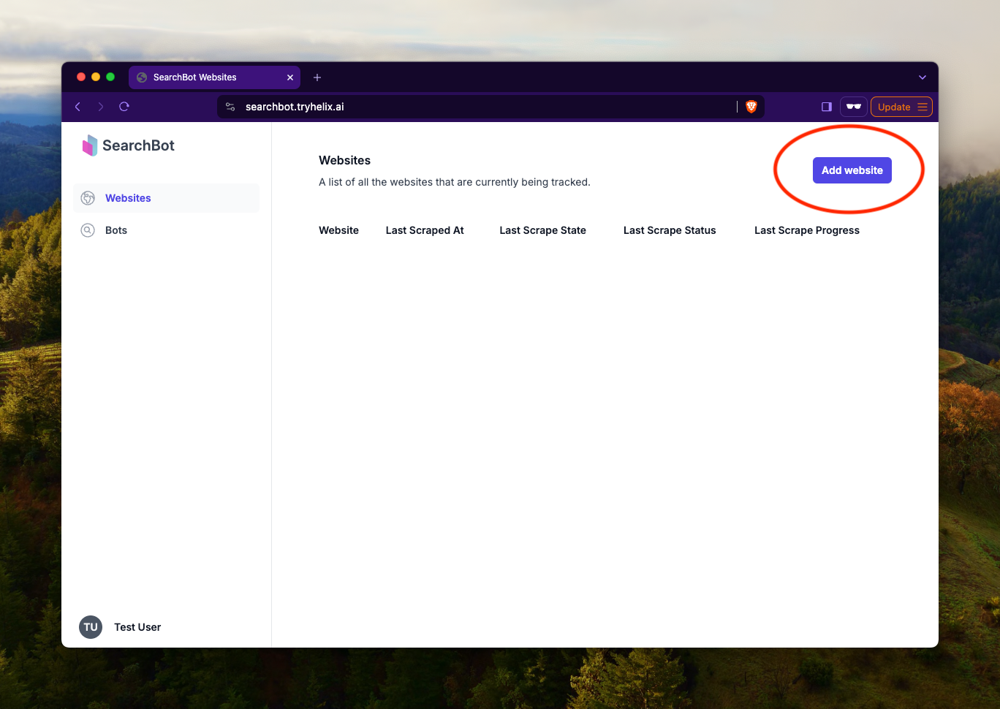

This page introduces Websites in SearchBot, explains what they are and discusses their use.

## Introduction

### What are Websites in SearchBot?

Websites are targets for SearchBot to scrape. When you create a new website, SearchBot will run a crawler that downloads all of the content of your website. It follows all internal links on your website, so it only scrapes what is navigable by your users.

Once a page has been downloaded, it is stored and given a unique ID. That website is then ready to be consumed by a Bot.

## Creating a Website

To create a website, navigate to the [Websites page]() in SearchBot, then click `Add Website`.

## Website fields

The following table describes the fields contained within a Website.

| Name | Description |
| ---| --- |
| Last Scraped At | When the website was last crawled, scraped and stored. |
| Last Scrape State | The state of the latest scrape ("Unknown", "Created", "Started", "Finished"). |
| Last Scrape Status | The status of the latest scrape ("Unknown", "Running", "Succeeded", "Failed"). |
| Last Scrape Progress | A depiction of the progress of the latest scrape. |

## Deleting a Website

To delete a website, press the <svg xmlns="http://www.w3.org/2000/svg" viewBox="0 0 24 24" fill="currentColor" class="w-6 h-6 text-red-600"><path fill-rule="evenodd" d="M16.5 4.478v.227a48.816 48.816 0 0 1 3.878.512.75.75 0 1 1-.256 1.478l-.209-.035-1.005 13.07a3 3 0 0 1-2.991 2.77H8.084a3 3 0 0 1-2.991-2.77L4.087 6.66l-.209.035a.75.75 0 0 1-.256-1.478A48.567 48.567 0 0 1 7.5 4.705v-.227c0-1.564 1.213-2.9 2.816-2.951a52.662 52.662 0 0 1 3.369 0c1.603.051 2.815 1.387 2.815 2.951Zm-6.136-1.452a51.196 51.196 0 0 1 3.273 0C14.39 3.05 15 3.684 15 4.478v.113a49.488 49.488 0 0 0-6 0v-.113c0-.794.609-1.428 1.364-1.452Zm-.355 5.945a.75.75 0 1 0-1.5.058l.347 9a.75.75 0 1 0 1.499-.058l-.346-9Zm5.48.058a.75.75 0 1 0-1.498-.058l-.347 9a.75.75 0 0 0 1.5.058l.345-9Z" clip-rule="evenodd" /></svg> button on the far right of the [list of Websites]().
