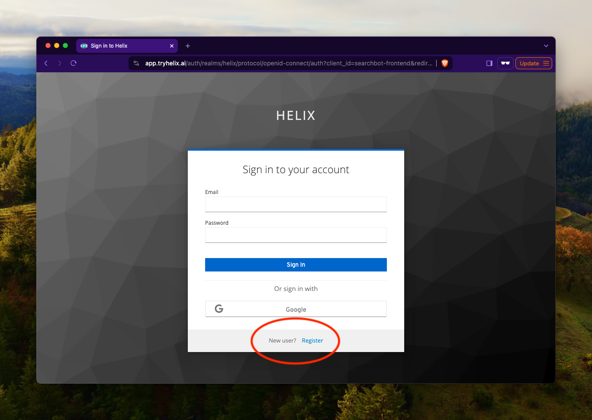
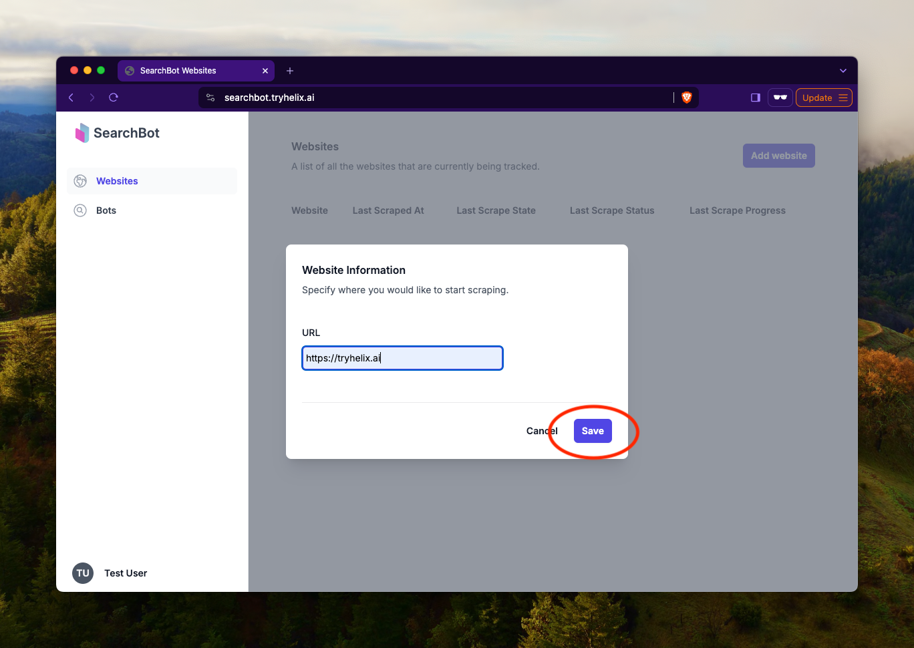
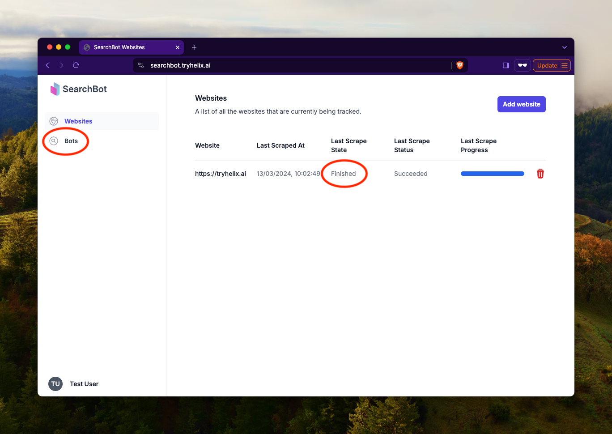
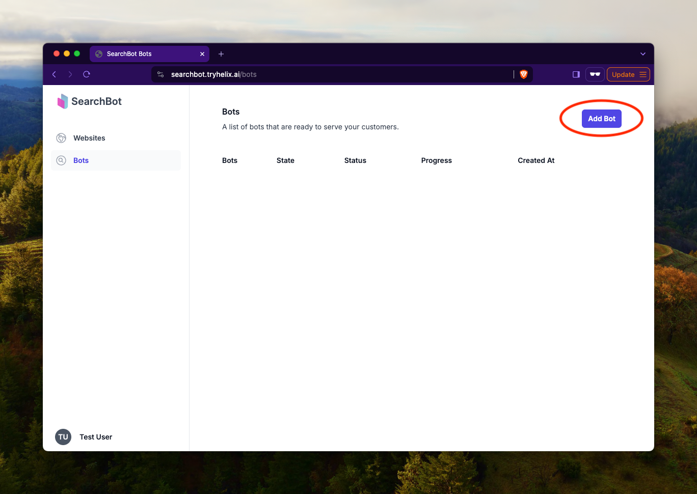
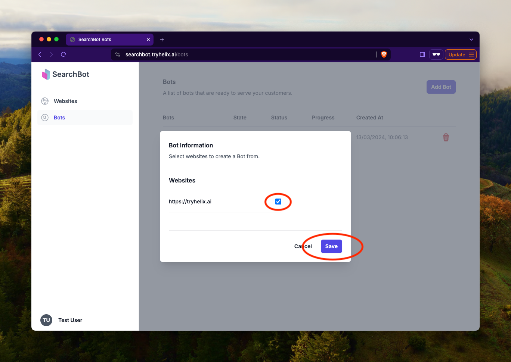
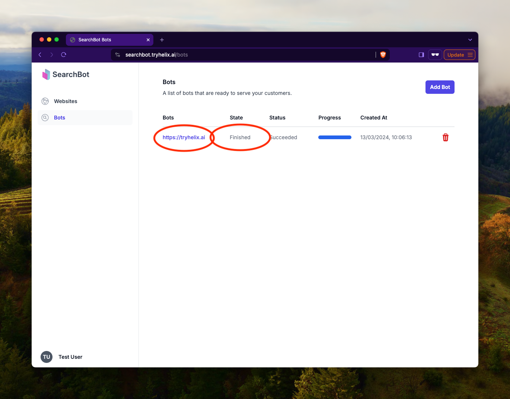
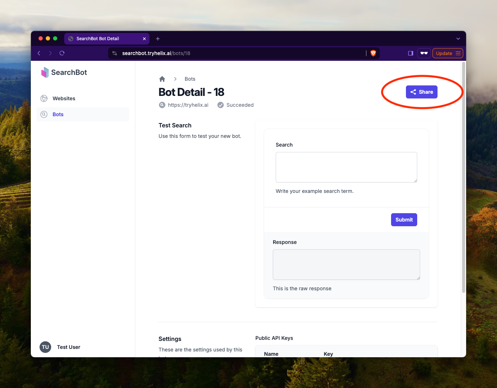
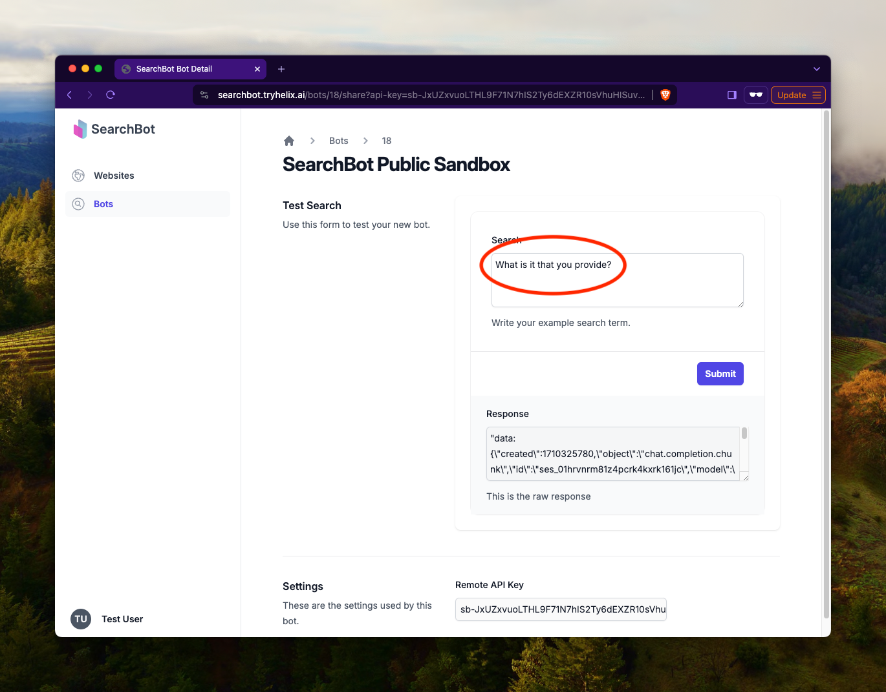

This document explains how to quickly get started with SearchBot. You should probably follow these steps first, unless you have used SearchBot in the past. For more in-depth explanations, please see the rest of the documentation.

## 1. Sign up for an account

Go to [https://SearchBot.tryhelix.ai](https://searchbot.tryhelix.ai)

## 2. Add a website

Navigate to the [Websites page]() and add a Website that you want to use with SearchBot. SearchBot will use all of the content on your Website as sources of information.

Please wait until your website has finished scanning. Click on the `Bots` tab.

{}
More information about Websites can be found in the [Website documentation]().
{}

## 3. Add a bot

Now add a bot and specify the settings for the bot. You should tick the box of the website you have just scanned.

Your bot is now learning your content. It will take a while to complete this step, so please come back later.

When it has finished, please click on the bot.

## 4. Test and share with friends

Click the share button.

Share your SearchBot with your friends by copying the URL. It is publicly accessible.

Type a query into the form on the share page and see how well SearchBot performs!

## 5. Add SearchBot to your website

{}
This feature isn't quite ready yet. Please email founders@helix.ml or join us on [Discord](https://discord.gg/VJftd844GE).
{}